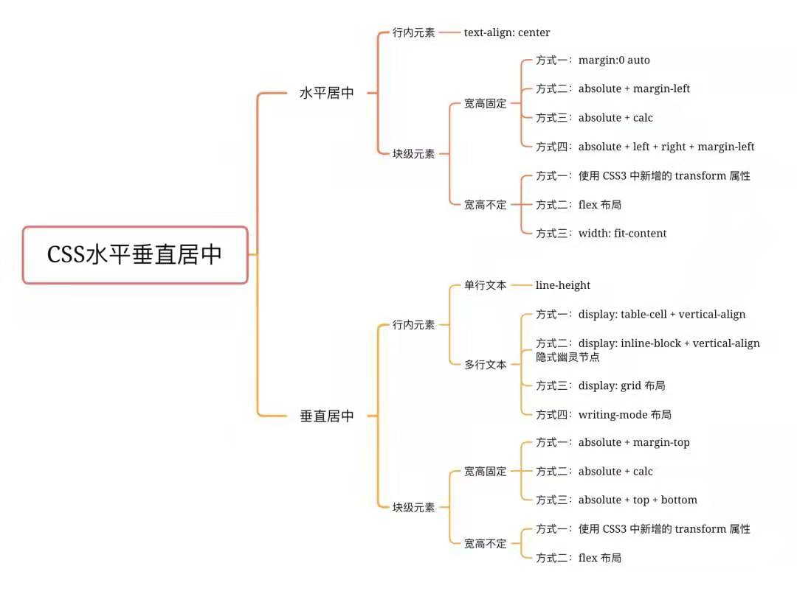

## 隐藏滚动条

```css
scrollbar-width: none;
&::-webkit-scrollbar {
	display: none;
	width: 0;
}
scroll-behavior: smooth;
```

## 计算属性 calc()

例：`width: calc(100% - 80px);`，支持加减乘除运算，括号中的+ 和 - 运算符的两边必须要有空白字符。\* 和 / 这两个运算符前后不需要空白字符，但可以加上。用 0 作除数会使 HTML 解析器抛出异常。

比如，`calc(50% -8px)` 会被解析成为一个无效的表达式，解析结果是：一个百分比 后跟一个负数长度值。而加有空白字符的、有效的表达式 `calc(8px + -50%)` 会被解析成为：一个长度 后跟一个加号 再跟一个负百分比。

## 滚动行为

scroll-behavior 为一个滚动框指定滚动行为，其他任何的滚动，例如那些由于用户行为而产生的滚动，不受这个属性的影响。在根元素中指定这个属性时，它反而适用于视窗。

-   auto：滚动框立即滚动。
-   smooth：比 auto 更「平稳」顺滑流畅滚动。

## 限制文字显示行数

1. -webkit-line-clamp

```css
display: -webkit-box;
overflow: hidden;
max-height: calc(2 * 1.15 * 1.5rem);
line-height: 25px;
word-break: break-all;
-webkit-box-orient: vertical;
-webkit-line-clamp: 2;
```

2. text-overflow: ellipsis

-   配合块级元素

```css
text-overflow: ellipsis;
overflow: hidden;
white-space: nowrap;
```

## Sticky

-   粘性定位可以被认为是相对定位和固定定位的混合。元素在跨越特定阈值前为相对定位，之后为固定定位。

-   用法：父级容器要有 height，overflow: scroll/auto/visible **要能滚动！**; 子元素 position: sticky;基于 top, right, bottom, 和 left 的值进行偏移。**跟 position 无关！**

-   须指定 top, right, bottom 或 left 四个阈值其中之一，才可使粘性定位生效。否则其行为与相对定位 position:relative 相同。

-   MDN: 元素根据正常文档流进行定位，然后相对它的最近滚动祖先（nearest scrolling ancestor）和 containing block (最近块级祖先 nearest block-level ancestor)，包括 table-related 元素，基于 top, right, bottom, 和 left 的值进行偏移。偏移值不会影响任何其他元素的位置。

-   该值总是创建一个新的层叠上下文（stacking context）。注意，一个 sticky 元素会“固定”在离它最近的一个拥有“滚动机制”的祖先上（当该祖先的 overflow 是 hidden, scroll, auto, 或 overlay 时），即便这个祖先不是最近的真实可滚动祖先。这有效地抑制了任何“sticky”行为。

## getComputedStyle()

-   Window.getComputedStyle(获取计算样式的 Element,要匹配的伪元素的字符串)方法返回一个对象，该对象在应用活动样式表并解析这些值可能包含的任何基本计算后报告元素的所有 CSS 属性的值。

-   CSS 属性的值: initial, computed, resolved, specified, used, and actual values.即初始、计算、解析、指定、使用和实际值。

```css
let elem1 = document.getElementById("elemId");
let style = window.getComputedStyle(elem1, null);

// 它等价于
// let style = document.defaultView.getComputedStyle(elem1, null);

```

## clear

-   MDN: clear CSS 属性指定一个元素是否必须移动(清除浮动后)到在它之前的浮动元素下面。clear 属性适用于浮动和非浮动元素。

-   MDN: 当应用于非浮动块时，它将非浮动块的边框边界移动到所有相关浮动元素外边界的下方。这个非浮动块的垂直外边距会折叠。

-   MDN: 另一方面，两个浮动元素的垂直外边距将不会折叠。当应用于浮动元素时，它将元素的外边界移动到所有相关的浮动元素外边框边界的下方。这会影响后面浮动元素的布局，后面的浮动元素的位置无法高于它之前的元素。

-   MDN: 要被清除的相关浮动元素指的是在相同块级格式化上下文中的前置浮动。

-   MDN: 注意：如果一个元素里只有浮动元素，那它的高度会是 0。如果你想要它自适应即包含所有浮动元素，那你需要清除它的子元素。一种方法叫做 clearfix，即 clear 一个不浮动的 ::after 伪元素。

```css
#container::after {
	content: "";
	display: block;
	clear: both;
}
```

## SCSS/SASS

使用 CSS 预处理器，提供 CSS 缺失的样式层复用机制、减少冗余代码，提高样式代码的可维护性。大大提高了我们的开发效率。

-   SCSS 是 Sass 3 引入新的语法，其语法完全兼容 CSS3，并且继承了 Sass 的强大功能。Sass 和 SCSS 其实是同一种东西，我们平时都称之为 Sass，两者之间不同之处有以下两点：

-   文件扩展名不同，Sass 是以“.sass”后缀为扩展名，而 SCSS 是以“.scss”后缀为扩展名

-   语法书写方式不同，Sass 是以严格的缩进式语法规则来书写，不带大括号({})和分号(;)，而 SCSS 的语法书写和我们的 CSS 语法书写方式非常类似。

```scss
# index.scss  定义变量并导出
$primary-color: #f40000;

:export {
  primaryColor: $primary-color;
}

# index.js
import styles from './index.scss';
// 可以直接引入并使用scss变量
console.log('styles', styles.primaryColor);
```

## 查看 UI 轮廓 outline

-   这里没有使用 border 的原因是 border 会增加元素的大小但是 outline 不会；
-   通过这个技巧不仅能帮助我们在开发中迅速了解元素所在的位置，还能帮助我们方便地查看任意网站的布局；
-   所有浏览器都支持 outline 属性;outline （轮廓）是绘制于元素周围的一条线，位于边框边缘的外围，可起到突出元素的作用;
-   轮廓线不会占据空间，也不一定是矩形（比如 2D 转换等）。

```css
html * {
	outline: 1px solid red;
}
```

## 提高长列表加载性能

-   content-visibility 属性有三个可选值:

1. visible: 默认值。对布局和呈现不会产生什么影响。
2. hidden: 元素跳过其内容的呈现。用户代理功能（例如，在页面中查找，按 Tab 键顺序导航等）不可访问已跳过的内容，也不能选择或聚焦。类似于对其内容设置了 display: none 属性。
3. auto: 对于用户可见区域的元素，浏览器会正常渲染其内容；对于不可见区域的元素，浏览器会暂时跳过其内容的呈现，等到其处于用户可见区域时，浏览器在渲染其内容。

```css
.card {
  position: relative;
  overflow: hidden;
  transition-duration: 0.3s;
  margin-bottom: 10px;
  width: 200px;
  height: 100px;
  background-color: #ffaa00;
  **content-visibility: auto;**
  // 添加此行:目的是在一定程度上解决滚动条上下跳动的问题，取一个item的大致高度作为初始高度
  **contain-intrinsic-size: 312px;**
}
.card:before {
  content: '';
  position: absolute;
  left: -665px;
  top: -460px;
  width: 300px;
  height: 15px;
  background-color: rgba(255, 255, 255, 0.5);
  transform: rotate(-45deg);
  animation: searchLights 2s ease-in 0s infinite;
}
@keyframes searchLights {
  0% {
  }
  75% {
    left: -100px;
    top: 0;
  }
  100% {
    left: 120px;
    top: 100px;
  }
}
```

## 隐藏打印弹窗

```css
@media print {
	body {
		display: none !important;
	}
}
```

## transform-origin

1.  设置元素转换的原点/起点。初始值 50% 50% 0，即默认的转换原点是 center。
2.  transform-origin 属性可以使用一个，两个或三个值来指定，其中每个值都表示一个偏移量。 没有明确定义的偏移将重置为其对应的初始值。
3.  如果定义了两个或更多值并且没有值的关键字，或者唯一使用的关键字是 center，则第一个值表示水平偏移量，第二个值表示垂直偏移量。

-   一个值：
    -   必须是`<length>`，`<percentage>`，或 left, center, right, top, bottom 关键字中的一个。
-   两个值：
    -   其中一个必须是`<length>`，`<percentage>`，或 left, center, right 关键字中的一个。
    -   另一个必须是`<length>`，`<percentage>`，或 top, center, bottom 关键字中的一个。
-   三个值：
    -   前两个值和只有两个值时的用法相同。
    -   第三个值必须是`<length>`。它始终代表 Z 轴偏移量。

## 修改图片「颜色」-- drop-shadow

-   背景色变化时突出图片，或者修改某个 icon 的背景色以实现变色（UI 垃圾！）。
-   drop-shadow 可用于 png 图片变色。

```css
img {
	width: 16px;
	height: 16px;
	margin: 0 0 4px 8px;
	filter: drop-shadow(0px 0px red); # x,y,color
}
```

-   通过 img 引入的 svg 如何改颜色?例如：``。

1. 通过 drop-shadow，把原始的 img 移到窗口/移出视线之外

```css
img {
	position: relative;
	left: -8000px;
	filter: drop-shadow(8000px 0px red);
}
```

2. 通过插件 `svg-inject`，`npm install @iconfu/svg-inject`

```html
<html>
	<head>
		<script src="svg-inject.min.js"></script>
		<style>
			.svg-img g {
				fill: blue;
			}
		</style>
	</head>
	<body>
		
	</body>
</html>
```

## font

-   至少包含 font-size 和 font-family;
-   可以按顺序设置如下属性：font-style、font-variant、font-weight、font-size/line-height、font-family、font-stretch;
-   特殊值：caption、icon、menu、message-box、small-caption、status-bar;

## 绘制三角形

-   普通三角形

```css
div {
	width: 0;
	height: 0;
	border: 40px solid;
	border-color: orange blue red green;
}
```

-   绘制带边框的三角形：通过::after 伪元素绘制一个稍大的三角形，然后左移即可。

-   绘制其它角度的三角形：其实它们都是基于之前绘制的三角形而来的。
    -   如果想绘制右直角三角，则将左 border 设置为 0；
    -   如果想绘制左直角三角，将右 border 设置为 0 即可（其它情况同理）。

```css
div {
	width: 0;
	height: 0;
	border: 40px solid;
	border-color: transparent transparent red;
	border-right-width: 0;
}
```

-   给 border 边框 再加边框 有一个属性可以用：
    -   轮廓: outline: 1px solid black;

## 水平垂直居中

-   

## CSS 伪类与伪元素

1. 伪类的效果可以通过添加一个实际的类来达到，而伪元素的效果则需要通过添加一个实际的元素才能达到，这也是为什么他们一个称为伪类，一个称为伪元素的原因。
2. 伪元素的权重比伪类高，比如一个容器的伪元素和伪类都定义了同一属性，但值不一样，那么将采用伪元素的。从规范的角度伪元素一个页面只使用一次，而伪类可以多次使用。
3. 伪元素产生新对象，在 DOM 中看不到，但是可以操作；伪类是 DOM 中一个元素的不同状态.

### 伪元素

css 的伪元素，之所以被称为伪元素，是因为他们不是真正的页面元素，html 没有对应的元素，但是其所有用法和表现行为与真正的页面元素一样，可以对其使用诸如页面元素一样的 css 样式，表面上看上去貌似是页面的某些元素来展现，实际上是 css 样式展现的行为，因此被称为伪元素。伪元素是通过样式来达到元素效果的，也就是说伪元素不占用 dom 元素节点。

css 有一系列的伪元素，如:before，:after，:first-line，:first-letter 等。

伪元素:before 和:after 添加的内容默认是 inline 元素；这个两个伪元素的 content 属性，表示伪元素的内容,设置:before 和:after 时必须设置其 content 属性，否则伪元素就不起作用。那么问题来了，content 属性的值可以有哪些内容呢，具体有以下几种情况：

1. 字符串，字符串作为伪元素的内容添加到主元素中

-   注意：字符串中若有 html 字符串，添加到主元素后不会进行 html 转义，也不会转化为真正的 html 内容显示，而是会原样输出

2. attr(attr_name), 伪元素的内容跟主元素的某个属性值进行关联，及其内容为主元素的某指定属性的值

-   好处：可以通过 js 动态改变主元素的指定属性值，这时伪元素的内容也会跟着改变，可以实现某些特殊效果，如图片加载失败用一段文字替换。

3. url()/uri(), 引用外部资源，例如图片；

4. counter(), 调用计数器，可以不使用列表元素实现序号问题。

-   伪元素不属于文档，所以 js 无法操作它

-   伪元素属于主元素的一部分，因此点击伪元素触发的是主元素的 click 事件

-   对于「块级元素才能有:before, :after」--其实是不妥的，大部分行级元素也可以设置伪元素，但是像 img 可替换元素，因为其外观和尺寸有外部资源决定，那么如果外部资源正确加载，就会替换掉其内部内容，这时伪元素也会被替换掉，但是当外部资源加载失败时，设置的伪元素是可以起作用的。

-   基于伪元素的特点可以知道其优缺点，也引用别人文章的话：

1. 优点

-   减少 dom 节点数
-   让 css 帮助解决部分 js 问题，让问题变得简单

2. 缺点

-   不利于 SEO
-   无法审查元素，不利于调试

#### :before 和:after 常见使用场景

1. 清除浮动

```css
// 1.
.block::after {
	clear: both;
	content: "\0020";
	display: block;
	height: 0;
	overflow: hidden;
}

// 2.
.clear-fix {
	*overflow: hidden;
	*zoom: 1;
}
.clear-fix::after {
	display: table;
	content: "";
	width: 0;
	clear: both;
}
```

2. 利用 attr()来实现某些动态功能

-   ``是一个替换元素，其外观和尺寸是由外部资源来决定的，当外部图片资源加载失败时其会显示破裂图片和 alt 文字，尺寸仅由其自身内容决定。这时``元素可以使用伪元素:before 和:after，因为其元素内容没有被替换；
-   利用 attr()来获取图片 alt 属性值作为伪元素:after 的 content 内容来替换 img 的内容，并运用适当的样式从而完成：图片加载成功时显示正常的图片，加载失败时显示图片破裂效果的样式.

```css
   img{
   min-height: 50px;
   position: relative;
   }
   img::before {
   content: " ";
   display: block;
   position: absolute;
   top: -10px;
   left: 0;
   height: calc(100% + 10px);
   width: 100%;
   backgound-color: rgb(230, 230,230);
   border: 2px dotted rgb(200,200,200);
   border-radius: 5px;
   }
   img::after {
   content: '\f127" " Broken Image of " attr(alt);
   display: block;
   font-size: 16px;
   font-style: normal;
   font-family: FontAwesome;
   color: rgb(100,100,100)
   position: absolute;
   top: 5px;
   left: 0;
   width: 100%;
   text-align: center;
   }
```

3. 与 counter()结合实现序号问题，而不用使用列表元素。

-   具体还要结合 css 的 counter-increment 和 counter-reset 属性的用法 。

```css
body {
	counter-reset: section;
}
h2::before {
	counter-increment: section;
	content: "Chapter" counter(section) ".";
}
```

4. 特效使用

-   利用这两个伪元素，可以实现各种效果，如放大镜、叉叉、箭头、三角符等
-   eg. blockquote 引用段添加巨大的引号作为背景:

```css
blockquote::before {
	content: open-quote;
	position: absolute;
	z-index: -1;
	color: #ddd;
	font-size: 120px;
	font-family: serif;
	font-weight: bolder;
}
```

#### 标准 & 伪元素索引

伪元素是一个附加至选择器末的关键词，允许你对被选择元素的特定部分修改样式。

一个选择器中只能使用一个伪元素。伪元素必须紧跟在语句中的简单选择器/基础选择器之后。

注意：按照规范，应该使用双冒号（::）而不是单个冒号（:），以便区分伪类和伪元素。但是，由于旧版本的 W3C 规范并未对此进行特别区分，因此目前绝大多数的浏览器都同时支持使用这两种方式来表示伪元素。

-   标准伪元素索引:

```css
::after (:after)
::backdrop
::before (:before)
::cue (:cue)
::first-letter (:first-letter)
::first-line (:first-line)
::grammar-error
::marker
::placeholder
::selection
::slotted()
::spelling-error
```

CSS 伪类 是添加到选择器的关键字，指定要选择的元素的特殊状态。

-   标准伪类索引：

```css
:active
:any-link
:blank
:checked
:current (en-US)
:default
:defined
:dir()
:disabled
:drop
:empty
:enabled
:first
:first-child
:first-of-type
:fullscreen
:future (en-US)
:focus
:focus-visible
:focus-within
:has()
:host
:host()
:host-context()
:hover
:indeterminate
:in-range
:invalid
:is()
:lang()
:last-child
:last-of-type
:left
:link
:local-link (en-US)
:not()
:nth-child()
:nth-col() (en-US)
:nth-last-child()
:nth-last-col() (en-US)
:nth-last-of-type()
:nth-of-type()
:only-child
:only-of-type
:optional
:out-of-range
:past (en-US)
:placeholder-shown
:read-only
:read-write
:required
:right
:root
:scope
:target
:target-within (en-US)
:user-invalid (en-US)
:valid
:visited
:where()
```

## 实现 CSS 与 JS 变量共享

### :export 关键字

```css
/* config.css */
$primary-color: #f40;

:export {
	primaryColor: $primary-color;
}
```

```js
/* app.js */
import style from "config.scss";

console.log(style.primaryColor); // #F40
```

## styled-components

-   用于生成并返回一个带样式的组件，既可以生成原生的 HTMLelement，也可以接受自定义组件，如：antd 的 Form、Modal 等组件 -- styled(Modal)\`...\`
-   通过 `${(props) => props.theme.colorXXX};` 来共享全局定义的 createGlobalStyle\`...\`全局样式，props 可以接收 styled 组件中的参数，例如：

```tsx
const Button = styled.button`
	/* Adapt the colors based on primary prop */
	background: ${(props) => (props.primary ? "palevioletred" : "white")};
	color: ${(props) => (props.primary ? "white" : "palevioletred")};

	font-size: 1em;
	margin: 1em;
	padding: 0.25em 1em;
	border: 2px solid palevioletred;
	border-radius: 3px;
`;

render(
	<div>
		<Button>Normal</Button>
		<Button primary>Primary</Button>
	</div>
);
```

-   也可以直接传参数，通过尖括号`<{xxx}>`的形式，本质还是通过 props 传参，例如：

```tsx
const StyledLoader = styled.div<{ fullScreen?: boolean }>`
	display: block;
	background-color: #fff;
	width: 100%;
	position: ${({ fullScreen }) => (fullScreen ? "fixed" : "absolute")};
	top: 0;
	bottom: 0;
	left: 0;
	z-index: 100000;
	display: flex;
	justify-content: center;
	align-items: center;
	opacity: 1;
	text-align: center;
`;
```

-   `<ThemeProvider theme={theme}>` 通过 styled-components 提供的 **ThemeProvider** 共享 theme 变量
-   通过类似` const Input = styled.input.attrs({ type: "checkbox" })``; `可以为生成的带样式的组件添加属性，如：id, className, type 等等
-   还可以传函数` const Thing = styled.div.attrs((/* props */) => ({ tabIndex: 0 }))``; `
-   **不要在函数组件内部创建 styled 组件！性能会很差！！可以放在外面创建！！！**

-   添加背景图片

```tsx
import HeaderImg from 'assets/images/header.png';
// 1.
background-image: url(${require('assets/images/header.png')}) no-repeat; // fixed bottom
// 2.
background-image: url(${HeaderImg}) no-repeat; // fixed bottom
```

## 加载动画

-   使用`styled-components`的组件

```js
import styled, { keyframes } from "styled-components";

const rotate = keyframes`
from{
  transform: rotate(0deg);
}
to{
  transform: rotate(360deg);
}
`;

const LoaderWrap = styled.div`
	display: inline-block;
	vertical-align: middle;
	animation: ${rotate} 1s linear infinite;
	img {
		width: 16px;
		height: 16px;
	}
`;
```

## 说说 CSS 选择器以及这些选择器的优先级

### 选择器

-   id 选择器(#myid)
-   类选择器(.myclass)
-   属性选择器(`a[rel="external"]`)
-   伪类选择器(`a:hover, li:nth-child`)
-   伪元素选择器(`a::before, li:after`)
-   标签选择器(`div, h1 ,p`)
-   相邻选择器（`h1 + p`）
-   子选择器(`ul > li`)
-   后代选择器(`li a`)
-   通配符选择器(`*`)

### 优先级

从高到低：

1. !important
2. 内联样式（1000）
3. ID 选择器（0100）
4. 类选择器/属性选择器/伪类选择器（0010）
5. 元素选择器/伪元素选择器（0001）
6. 关系选择器/通配符选择器（0000）

带!important 标记的样式属性优先级最高； 样式表的来源相同时：!important > 行内样式 > ID 选择器 > 类选择器 > 标签 > 通配符 > 继承 > 浏览器默认属性

## BFC

-   BFC 全称为块级格式化上下文 (Block Formatting Context) 。

触发 BFC 的条件：dofp

1. `<html>`根元素或其它包含它的元素
2. 浮动元素 (元素的 float 不是 none)`float: left/right;`
3. 绝对定位元素 (元素具有 position 为 absolute 或 fixed)`position: absolute/fixed`
4. 内联块 (元素具有 display: inline-block)
5. 表格 `display: table`
6. 表格单元格 (元素具有 `display: table-cell/table-row`，HTML 表格单元格默认属性)
7. 表格标题 (元素具有 `display: table-caption`, HTML 表格标题默认属性)
8. 具有 overflow 且值不是 visible 的块元素`overflow: auto/scroll/hidden;`
9. 弹性盒（flex 或 inline-flex）
10. `display: flex/grid;`的直接子元素
11. `display: flow-root`
12. `column-span: all`

BFC 可以解决的问题:

1. 垂直外边距重叠问题
2. 去除浮动
3. 自适应两列布局（float + overflow）

## href 与 src

href 表示超文本引用，用在 link 和 a 等元素上，href 是引用和页面关联，是在当前元素和引用资源之间建立联系，src 表示引用资源，表示替换当前元素，用在 img，script，iframe 上，src 是页面内容不可缺少的一部分。

> src 是 source 的缩写，是指向外部资源的位置，指向的内部会迁入到文档中当前标签所在的位置；在请求 src 资源时会将其指向的资源下载并应用到当前文档中，例如 js 脚本，img 图片和 frame 等元素。

`<script src="js.js"></script>`当浏览器解析到这一句的时候会暂停其他资源的下载和处理，直至将该资源加载，编译，执行完毕，图片和框架等元素也是如此，类似于该元素所指向的资源嵌套如当前标签内，这也是为什么要把 js 放在底部而不是头部。

`<link href="common.css" rel="stylesheet"/>`当浏览器解析到这一句的时候会识别该文档为 css 文件，会下载并且不会停止对当前文档的处理，这也是为什么建议使用 link 方式来加载 css 而不是使用@import。

补充：link 和@import 的区别：

> 两者都是外部引用 CSS 的方式，但是存在一定的区别：

-   区别 1：link 是 XHTML 标签，除了加载 CSS 外，还可以定义 RSS 等其他事务；@import 属于 CSS 范畴，只能加载 CSS。
-   区别 2：link 引用 CSS 时，在页面载入时同时加载；@import 需要页面网页完全载入以后加载。
-   区别 3：link 是 XHTML 标签，无兼容问题；@import 是在 CSS2.1 提出的，低版本的浏览器不支持。
-   区别 4：link 支持使用 Javascript 控制 DOM 去改变样式；而@import 不支持。

## 加一个边框

```css
border: 10px solid hsla(0, 0%, 100%, 0.5);
background-clip: padding-box; // 使用paddingbox
```

## 太极

```css
.yin-yang {
	height: 200px;
	width: 200px;
	position: relative;
	background: rgb(255, 255, 255);
	background: linear-gradient(
		90deg,
		rgba(255, 255, 255, 1) 0%,
		rgba(255, 255, 255, 1) 50%,
		rgba(0, 0, 0, 1) 50%,
		rgba(0, 0, 0, 1) 100%
	);
	border-radius: 50%;
	box-sizing: border-box;
	border: 4px solid black;
}
.yin-yang::before {
	content: "";
	position: absolute;
	height: 96px;
	width: 96px;
	border-radius: 50%;
	box-sizing: border-box;
	background: black;
	border: 38px solid white;
	left: 50%;
	transform: translatex(-50%);
}
.yin-yang::after {
	content: "";
	position: absolute;
	height: 96px;
	width: 96px;
	border-radius: 50%;
	box-sizing: border-box;
	background: white;
	border: 38px solid black;
	left: 50%;
	bottom: 0;
	transform: translatex(-50%);
}
```

## @font-face

```css
@font-face {
	font-family: myFirstFont; /* 必需的 */
	src: url("xxx.ttf") [, url(xxx.xyz), ...]; /* 必需的 */
}
```

## nth-child & nth-of-type

-   nth-child

按照个数来算。

-   nth-of-type

按照类型来计算，如果是 class 那么碰到不同类型的，单独一类，符合条件的选中。

## Tips

### 设置阴影

当使用透明图像时，可以使用 `filter: drop-shadow()` 函数在图像上创建阴影，而不是使用 `box-shadow` 属性在元素的整个框后面创建矩形阴影.

```css
.drop-shadow {
	filter: drop-shadow(2px 4px 8px #585858);
}
```

### 平滑滚动

无需 JavaScript 即可实现平滑滚动，只需一行 CSS：`scroll-behavior: smooth；`.

### 自定义光标

在某个 DOM 元素上可以使用自定义图像，甚至表情符号来作为光标。

```css
.tile-image-cursor {
	background-color: #1da1f2;
	cursor: url(https://picsum.photos/20/20), auto;
}
.tile-emoji-cursor {
	background-color: #4267b2;
	cursor: url("data:image/svg+xml;utf8,<svg xmlns='http://www.w3.org/2000/svg'  width='40' height='48' viewport='0 0 100 100' style='fill:black;font-size:24px;'><text y='50%'>🚀</text></svg>"),
		auto;
}
```

### 截断文本

一行文本溢出隐藏：

```css
div {
	width: 200px;
	background-color: #fff;
	padding: 15px;
	white-space: nowrap;
	overflow: hidden;
	text-overflow: ellipsis;
}
```

还可以使用“-webkit-line-clamp”属性将文本截断为特定的行数。文本将在截断的地方会显示省略号：

```css
div {
	width: 200px;
	display: -webkit-box;
	-webkit-box-orient: vertical;
	-webkit-line-clamp: 2;
	overflow: hidden;
}
```

### 自定义选中样式

CSS 伪元素::selection，可以用来自定义用户选中文档的高亮样式。

```css
.custom-highlighting::selection {
	background-color: #8e44ad;
	color: #fff;
}
```

### CSS 模态框

使用 CSS 中的 :target 伪元素来创建一个模态框。

### 空元素样式

可以使用 :empty 选择器来设置完全没有子元素或文本的元素的样式：

```css
.box {
	display: inline-block;
	background: #999;
	border: 1px solid #585858;
	height: 200px;
	width: 200px;
	margin-right: 15px;
}

.box:empty {
	background: #fff;
}
```

### 创建自定义滚动条

滚动的条件：父容器设置了`height`和`overflow!=visiable`，子元素高度要超过父容器。

```css
.tile-custom-scrollbar::-webkit-scrollbar {
	width: 12px;
	background-color: #eff1f5;
}

.tile-custom-scrollbar::-webkit-scrollbar-track {
	border-radius: 3px;
	background-color: transparent;
}

.tile-custom-scrollbar::-webkit-scrollbar-thumb {
	border-radius: 5px;
	background-color: #515769;
	border: 2px solid #eff1f5;
}
```

### 动态工具提示 tooltip

可以使用 CSS 函数 attr() 来创建动态的纯 CSS 工具提示 。

```html
<h1>HTML/CSS tooltip</h1>
<p>
	Hover <span class="tooltip" data-tooltip="Tooltip Content">Here</span> to
	see the tooltip.
</p>
<p>
	You can also hover
	<span class="tooltip" data-tooltip="This is another Tooltip Content"
		>here</span
	>
	to see another example.
</p>
```

```css
.tooltip {
	position: relative;
	border-bottom: 1px dotted black;
}

.tooltip:before {
	content: attr(data-tooltip);
	position: absolute;
	width: 100px;
	background-color: #062b45;
	color: #fff;
	text-align: center;
	padding: 10px;
	line-height: 1.2;
	border-radius: 6px;
	z-index: 1;
	opacity: 0;
	transition: opacity 0.6s;
	bottom: 125%;
	left: 50%;
	margin-left: -60px;
	font-size: 0.75em;
	visibility: hidden;
}

.tooltip:after {
	content: "";
	position: absolute;
	bottom: 75%;
	left: 50%;
	margin-left: -5px;
	border-width: 5px;
	border-style: solid;
	opacity: 0;
	transition: opacity 0.6s;
	border-color: #062b45 transparent transparent transparent;
	visibility: hidden;
}

.tooltip:hover:before,
.tooltip:hover:after {
	opacity: 1;
	visibility: visible;
}
```

### 圆形渐变边框

```html
<div class="box gradient-border">炫酷渐变边框</div>
```

```css
.gradient-border {
	border: solid 5px transparent;
	border-radius: 10px;
	background-image: linear-gradient(white, white), linear-gradient(315deg, #833ab4, #fd1d1d
				50%, #fcb045);
	background-origin: border-box;
	background-clip: content-box, border-box;
}

.box {
	width: 350px;
	height: 100px;
	display: flex;
	align-items: center;
	justify-content: center;
	margin: 100px auto;
}
```

### 灰度图片

可以使用 `filter: grayscale()` 过滤器功能将输入图像转换为灰度。

```css
.gray {
	filter: grayscale(100%);
}
```

### 打印分页时，换页处样式

```css
@media print {
	@page {
		margin: 2cm;
	}
}
```

### 数字等宽

比如：1 和 9 宽度是不一样的。

-   font-variant-numeric: CSS 属性控制数字，分数和序号标记的替代字形的使用；
-   tabular-nums: 启用表格数字显示。使数字等宽，易于像表格那样对齐。等同于 OpenType 特性 tnum。
-   也可以通过 font-feature-settings: "tnum";来实现相同的功能，兼容性更好。

### font-variant

-   `font-variant:small-caps;` 可以实现把段落设置为小型大写字母字体，这意味着所有的小写字母均会被转换为大写，但是所有使用小型大写字体的字母与其余文本相比，其字体尺寸更小。

### offsetWidth、clientWidth、scrollWidth、scrollTop 的区别

1. offsetWidth：border+padding+content;
2. clientWidth：padding+content;
3. scrollWidth：padding+content 实际宽度;
4. scrollTop：向上滚动的距离;

### NodeList、HTMLCollection 的区别

0. 都是类数组，不是真正的数组，要用 Array.from()转换。
1. Node 是 Document、DocumentFragment、Element、CharacterData 等的基类，Element 是 HTMLElement、SVGElement 的基类，HTMLElement 是 HTMLHEADElement、HTMLInputElement、HTMLTitleElement 等的基类。
2. 获取 Node 和 Element 的返回结果可能不一样，如 elem.childNodes 和 elem.children 不一样。
3. 前者 Node 会包含 Text、Comment 等节点，后者 Element 只会包含 HTML 原素。

### 毛玻璃效果

使用 `backdrop-filter: blur(6px);` 给元素后面区域添加模糊效果.

### 改变输入框光标颜色

```css
input {
	caret-color: red;
}
```

### 阻止你的用户复制文本

```css
div {
	-webkit-user-select: none; /* Safari */
	-ms-user-select: none; /* IE 10 and IE 11 */
	user-select: none; /* Standard syntax */
}
```

### Filter 属性

```css
filter: drop-shadow(16px 16px 20px red);
filter: blur(5px);
filter: contrast(200%);
filter: grayscale(80%);
```

### writing-mode 文字排版方向

```css
writing-mode: vertical-lr;
```

### Grid 中的 place-items

在 grid 布局中，align-items 属性控制垂直位置，justify-items 属性控制水平位置。这两个属性的值一致时，就可以合并写成一个值。所以，`place-items: center;`等同于`place-items: center center;`。

```css
place-items: center stretch;
```

## 如何覆盖组件库的样式

在开发中，经常需要修改第三方组件库的样式，比如 ant-design 和 elementUI，一般有这么几种做法：

1. 直接修改 node_modules 中的源码：多端难以同步，不可取；
2. 修改全局样式：容易与别人的样式发生冲突，也可能不允许这么做，视情况；
3. 样式隔离 CSS Module（React）和 Scoped（Vue)：推荐；

### CSS 中的样式隔离

#### CSS Module（React）

CSS Module 的原理：它的使用很简单，在 CSS 文件加一个后缀`.module`，然后当做一个变量引入到 JS 文件中。

```js
// src/Demo.js
import styles from "./demo.module.css";
export default function Demo() {
	return (
		<div className={styles.myWrapper}>
			<Calendar />
		</div>
	);
}
```

```css
/* src/demo.module.css */
.myWrapper {
	border: 5px solid black;
}
```

被编译后 👇，插入的样式表和元素的 class 属性都会加上一个哈希值作为命名空间。

```html
<style>
	.demo_myWrapper__Hd9Qg {
		border: 5px solid black;
	}
</style>
<div class="demo_myWrapper__Hd9Qg">...</div>
```

React 给我们提供了一个语法`:global`。它生效范围内的样式会被当作全局 CSS。具体使用如下，在 CSS 文件中，使用`:global`包裹希望全局生效的样式，`:global`作用域下的样式编译过后都不会加上哈希：

```css
:global(.ant-picker-calendar-full
		.ant-picker-panel
		.ant-picker-calendar-date-today) {
	border-color: purple; /* 覆盖为紫色 */
}
/* SCSS或SASS中，还可以使用嵌套语法： */
:global {
	.ant-picker-calendar-full
		.ant-picker-panel
		.ant-picker-calendar-date-today {
		border-color: purple;
	}
}
```

借助`:global`语法，即使使用 CSS Module 进行样式隔离也可以如愿实现覆盖功能。

#### Vue 中的 Scoped

Vue 中也有类似的样式隔离功能，使用 Scoped 标记 CSS 部分，使用也很简单 👇：

```vue
<div class="myWrapper">
  <Calendar />
</div>
<style scoped>
.myWrapper {
	border: 5px solid black;
}
</style>
```

编译出来的代码如下 👇：

```html
<style>
	.myWrapper[data-v-2fc5154c] {
		border: 5px solid black;
	}
</style>
<div class="myWrapper" data-v-2fc5154c>...</div>
```

实际就是借助属性选择器实现样式隔离，样式只会对有 data-v 属性的标签生效。此时 UI 组件库内部的 HTML 元素都没有该属性，因此样式不会对他生效。所以 Vue 提供了一个类似的语法：深度作用选择器。

使用很简单，把要“渗透“进组件内部的样式前面加上`>>>`，作用域内的 CSS 样式都不会带上哈希值作为属性选择器。也可以将`>>>`写成`/deep/`或者`::v-deep`。

相较于 React 的`:global`，Vue 的深度作用选择器是一种更优秀的方案，它必须要一个前导（也就是上面例子中的`.myWrapper` 选择器），前导依旧会被打上哈希值作为属性选择器，要渗透进去的样式实际上是作为它的子选择器，只在当前这个文件下生效，彻底避免造成全局污染。

#### ShadowDOM

ShadowDOM 是 web components 方案中非常重要的一个新增对象，它通过在 custom element 中使用 attachShadow 来开启，开启之后，一个 HTMLElement 将不再显示其原本内部的元素，而是显示其 shadowRoot 内的元素，shadowRoot 是一个 document fragment，是脱离原始文档流的一种存在，因此它具有 css 样式隔离性，通过这种隔离，我们可以很好的在应用中实现一些局部样式的重置和定义（当然，还有组件化效果）。

```js
const snake = document.querySelector("#snake");
const root = snake.createShadowRoot();
root.inner = `
  <style>span { color: red }</style>
  ${snake.innerHTML}
`;
```

#### 总结

综上，对于 Vue 项目，使用提供了一个类似的语法：深度作用选择器--`>>>`或者`/deep/`或者`::v-deep`即可。对于 React 项目，可以使用`:global`属性。

#### React 中 AntDesign 组件样式修改

1. 方法一：借助`styled-components`的 GlobalStyle，创建全局样式；
2. 方法二：创建单独的 style 文件夹，并对相应的组件的样式进行重写，之后在 app.js 中引入，打包的时候确保自定义的样式在 AntDesign 默认样式之后引入即可；

## 防御性 CSS 技能

防的是一切使表现和行为偏离预期效果的情景。出现这些场景的原因是因为终端环境的多样化，开发及测试用例只能覆盖大多数使用场景，在其他环境下，解析机制差异、内容动态变化等，都是导致非预期效果的原因。

### flex-wrap

控制 flex 容器内元素所占空间超出 flex 容器空间时是否折行。flex-wrap 属性默认是不折行的，容易忽略多元素溢出兜底；为兜底，请设置`flex-wrap: wrap;`

### margin 间距

调整元素的外边距。用于指定元素与周围空间的距离关系。场景：防止元素与元素之间挤压空间，造成重叠等情况；比如文本溢出、元素换行之后重叠在一起等。

### 长文本处理

当文本长度超出容器时，该如何显示。

1. 换行：不要设置容器的 height 和 word-break 即可；

2. 省略：

```css
white-space: nowrap;
overflow: hidden;
text-overflow: ellipsis;
```

3. 固定展示几行后省略剩余部分：

```css
display: -webkit-box;
overflow: hidden;
max-height: calc(2 * 1.15 * 1.5rem);
line-height: 25px;
word-break: break-all;
-webkit-box-orient: vertical;
-webkit-line-clamp: 2;
```

### 防止图像被拉伸或压缩

通常，服务器下发的图片尺寸以及用户自定义上传的图片，显示在页面时，不可能百分百与容器尺寸贴合，不可避免的会遇到图片的放缩处理：`object-fit: cover;`

### 锁定滚动链接

`overscroll-behavior`是`overscroll-behavior-x`和`overscroll-behavior-y`的简写属性，它控制的是元素滚动到边界时的表现。换个能听得懂的说法：在 JS 世界里，有事件冒泡机制，你可以通过 event 的 stopPropagation 方法去阻止冒泡的发生，同样，在 CSS 世界里，滚动也有冒泡机制，当内部元素滚动到边界时，如果继续滚动，会带动外层祖先元素发生滚动，这种现象被称为滚动链，为了方便记忆，你也可以把他形象的记忆为滚动冒泡。而`overscroll-behavior`这个属性，就是类似 event 的 stopPropagation 方法阻止冒泡事件一样，提供给开发者去控制内层元素是否可以发生”冒泡“带动外层元素滚动的属性。

页面存在多层滚动元素，需要单独控制每层滚动是否引起外层滚动；

```css
.child {
	overscroll-behavior-y: contain; // 默认是auto；none  和 contain 一样，但它也可以防止节点本身的滚动效果
	overflow-y: auto;
}
```

### CSS 变量默认值

CSS 变量可以实现动态控制元素属性，但是当 CSS 变量未定义或无效时，造成变量值异常，此时，元素的样式将会脱离预期，而变量默认值可以实现异常兜底，保证变量值异常时页面依然能运行。

```css
.item {
	color: var(--my-var, red); /* Red if --my-var is not defined */
}
```

### 弹性元素尺寸 min-height / min-width

当需求要求完整展示某个列表数据，但列表数据所占空间无法固定时，为避免部分内容过宽、过高突破固定空间破坏布局，可以使用弹性尺寸 min-_ 或者 max-_ , 这样能自动适应部分内容所占空间过大或过小带来的样式美观问题；

### 被遗忘的 background-repeat

使用图片作为容器的背景图，当容器的尺寸大于图片尺寸时，默认背景图会重复，如果你在开发中忽略了上述问题，则会出现背景图重复的问题:`background-repeat: no-repeat;`

### 媒体查询 @media

媒体查询的使用更像是 CSS 中的条件判断，它会根据你定义的条件，当条件满足时，条件内的样式生效；

```css
/* 将 body 的背景色设置为蓝色 */
body {
	background-color: blue;
}

/* 在小于或等于 800 像素的屏幕上，将背景色设置为黄色 */
@media screen and (max-width: 800px) {
	body {
		background-color: yellow;
	}
}

/* 在 600 像素或更小的屏幕上，将背景色设置为红色 */
@media screen and (max-width: 600px) {
	body {
		background-color: red;
	}
}
```

### 图片上的文字

当需要在图片上层展示文字时，如果图片加载失败，而外层容器的背景色和文字颜色接近，那么文字的展示效果就不理想；可以给图片容器设置适当的背景色。至于图片加载失败时左上角的“破图”标记，可以使用伪类进行遮挡美化；

### 合理使用滚动条属性

overflow 属性有两个作用很相近的属性值，一个是 scroll, 另一个是 auto; 这两个属性值都能实现当内容大于所占空间时滚动展示，不同点在于使用 scroll 属性无论内容是否超出容器空间，都会展示滚动条，而 auto 属性会分辩条件，内容超出时才会展示滚动条，为超出时则会自动隐藏，样式上较为美观；

### 预留滚动条空间，避免重排

一开始就预留好滚动条的位置，只是不可见，到了滚动条应该出场的时候再让它可见，就能避免不必要的重排了。借助`scrollbar-gutter: stable;`即可实现；也可以把滚动条干掉；

### 图片最大宽度

当给固定宽高容器设置背景图时，如果背景图尺寸超过容器宽高，图片会溢出，因此，最好在项目的 resetCss 中按照以下属性属性初始化：

```css
img {
	max-width: 100%;
	object-fit: cover;
}
```

### 粘性定位

position 的粘性定位指的是通过用户的滚动，元素的 position 属性在 position:relative 与 position:fixed 定位之间切换；这对于需要使用滚动吸顶的场景非常方便；是典型的依据业务场景推动 CSS 技术发展的典例；

### 浏览器兼容性 CSS 请勿批量处理

根据 W3C 标准，批量分组选择选择器，如果分组中，其中一个无效，那么整个选择器都将会失效。因此，在遇到浏览器兼容属性时，切勿批量组合书写；
