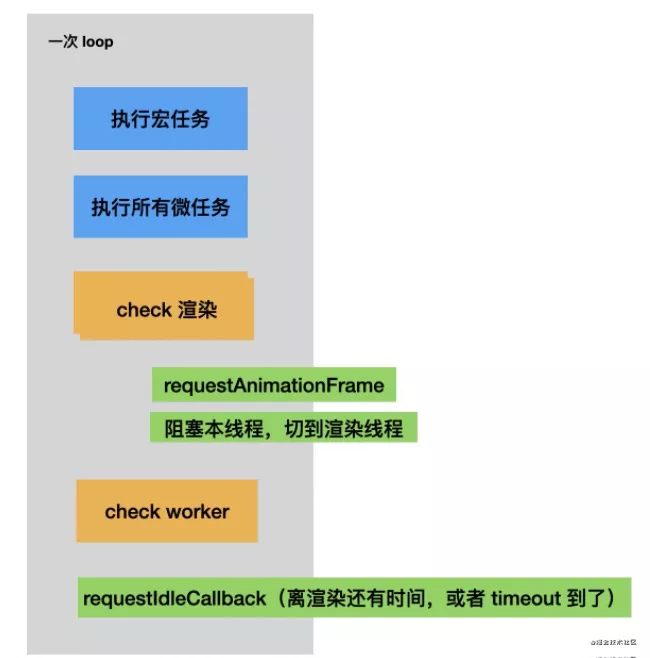
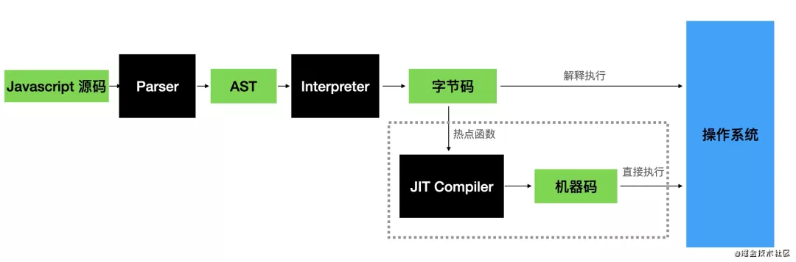

## 图灵完备性

在可计算性理论，如果一系列操作数据的规则（如指令集、编程语言、细胞自动机）可以用来模拟任何图灵机，那么它是图灵完备的。这意味着这个系统也可以识别其他数据处理规则集，图灵完备性被用作表达这种数据处理规则集的一种属性。如今，几乎所有编程语言都是具有图灵完备性的。

## 好用的开发工具、插件

- Chrome 扩展：Access-Control-Allow-Origin 自动跨域插件，可以自行配置跨域域名方法等；
- Log 工具：VConsole，用于在移动端、H5 进行日志打印，方便调试；

## Mixed Content

- 混合内容是指 https 页面下有非 https 资源时，浏览器的加载策略。
- 在 Chrome 80 中，如果你的页面开启了 https，同时你在页面中请求了 http 的音频和视频资源，这些资源将将自动升级为 https ，并且默认情况下，如果它们无法通过 https 加载，Chrome 将阻止它们。这样就会造成一些未支持 https 协议的资源加载失败。

- 最合理的方案：

1. 全站统一 https-但是有些时候内容是用户产生的，或者第三方数据；
2. 同域-nginx 强制跳转 https NGINX 配置：server{listen xx.xx.xx.xx; server_name xx.com; rewrite ^(.\*)$ https://$host$1 permanent;}；

- 跨域的方案：

1. 资源有 http 和 https 协议，但是 url 是 http 的， 兼容低版本浏览器；
   `<meta http-equiv="Content-Security-Policy" content="upgrade-insecure-requests">`
2. JS 拦截簒改 base host， 然后 Nginx 转发/后端代理；

## MIME sniffing 嗅探

- 引入 MIME sniffing 功能的初衷是用来弥补 Web 服务器响应一个图像请求时有可能返回错误的内容类型 Content-Type 信息这一缺陷;

- 嗅探攻击解决方案：

1. 给返回内容加上对应的 contentType；
2. 添加响应头 X-Content-Type-Options: nosniff，让浏览器不要尝试去嗅探；

- 嗅探乱码原因：<meta charset="utf-8" >只对 HTML 内容解析有效，对于 css 内容中(外部样式表下)的双字节字符（如中文）解析并没有作用，如果浏览器请求回来的 css 资源的 HTTP 响应头里的 Content-Type 未指明"charset=utf-8"的话，浏览器根据自身的嗅探机制来决定采用哪一种编码解析，结果就会概率出现双字节字符乱码的情况；
- 解决方法：

1. css 资源请求的响应头的 Content-Type 增加"charset=utf-8"声明；
2. 使用  @charset
3. 使用  css-unicode-loader

## Cookie/Set-Cookie

- 登录的原理：

- 问题：通过 http 方式访问一个 https 网站时，登录有时会失效（无法登陆、跳转），Cookies 中的 token 没有写成功
- 原因：http 和 https 返回的 tokenName 相同，由于一个是 insecure 一个是 secure 的，两者不能互相覆盖，导致 cookie 中的 sso-token 写入失败，所以也就无法登陆了。
- 查看接口，发现：Response Headers 中的 Set-Cookie 是拿到了返回值的，但是后面有个黄色三角感叹号，提示：This Set-Cookie was blocked because it was not sent over a secure connection and would have overwritten a cookie with the Secure attribute.

- 解决方案

1. 使用 https，Set-Cookie 中会有 Secure 字段；
2. 在 chrome 中打开链接： `chrome://flags/#site-isolation-trial-opt-out`，搜索 samesite 上述三个选项禁用(设为 disable)后重启 chrome，问题解决；
3. 删掉 https 下的 token
4. 无痕模式（有时也不行，是因为无痕模式打开时也写入了 cookie）

- 几种常见的策略

1. Same Origin Policy
2. Content Security Policy (CSP)
3. Referrer-Policy

## 针对新版本 Chrome>90.x? Samesite 策略不能设置，导致开发时页面跳转出现问题

```bash
open -n /Applications/Google\ Chrome.app/ --args --disable-features=SameSiteByDefaultCookies

或

open -a "Google Chrome" --args --disable-features=SameSiteByDefaultCookies
```

完全关闭 Chrome，打开命令行运行上述命令。

## 删除文件/文件夹

- rimraf 包的作用：以包的形式包装 rm -rf 命令，用来删除文件和文件夹的，不管文件夹是否为空，都可删除

```js
const rimraf = require("rimraf");
rimraf("./test.txt", function (err) {
	// 删除当前目录下的 test.txt
	console.log(err);
});
```

## 闭包

- 作用域链：在 JavaScript 里面，函数、块、模块都可以形成作用域（一个存放变量的独立空间），他们之间可以相互嵌套，作用域之间会形成引用关系，这条链叫做作用域链。
- 查看作用域链：

```js
const parser = require("@babel/parser");
const traverse = require("@babel/traverse").default;

const code = `
  function func() {
    const guang = 'guang';
    function func2() {
      const ssh = 'ssh';
      {
        function func3 () {
          const suzhe = 'suzhe';
        }
      }
    }
  }
`;

const ast = parser.parse(code);

traverse(ast, {
	FunctionDeclaration(path) {
		if (path.get("id.name").node === "func3") {
			console.log(path.scope.dump());
		}
	},
});
```

- 函数和块的作用域内的变量声明会在作用域 （scope） 内创建一个绑定（变量名绑定到具体的值，也就是 binding），然后其余地方可以引用 （refer） 这个 binding，这样就是静态作用域链的变量访问顺序。

- 静态：因为这样的嵌套关系是分析代码就可以得出的，不需要运行，按照这种顺序访问变量的链就是静态作用域链，这种链的好处是可以直观的知道变量之间的引用关系。静态作用域链是可以做静态分析的。

- JavaScript 除了静态作用域链外，还有一个特点就是函数可以作为返回值！这就会引出闭包。
- 父函数作用域中有很多东西与子函数无关，所以不会因为子函数没结束就一直常驻内存。这样肯定有性能问题，所以还是要销毁。但是销毁了父作用域不能影响子函数，所以要再创建个对象，要把子函数内引用（refer）的父作用域的变量打包里来，给子函数打包带走。
- 闭包的机制：销毁父作用域后，把用到的变量包起来，打包给子函数，放到一个属性上 [[Scopes]]。
- 即使子函数没有引用父函数的变量，他也会有一个闭包--闭包最少会包含全局作用域。
- 需要打包的只是环境内没有的，也就是闭包只保存外部引用。然后是在创建函数的时候保存到函数属性上的，创建的函数返回的时候会打包给函数，但是 JS 引擎怎么知道它要用到哪些外部引用呢，需要做 AST 扫描，很多 JS 引擎会做 Lazy Parsing，这时候去 parse 函数，正好也能知道它用到了哪些外部引用，然后把这些外部用打包成 Closure 闭包，加到 [[scopes]] 中。

- 所以，闭包是返回函数的时候扫描函数内的标识符引用，把用到的本作用域的变量打成 Closure 包，放到 [[Scopes]] 里。调用该函数的时候，JS 引擎 会取出 [[Scopes]] 中的打包的 Closure + Global 链，设置成新的作用域链， 这就是函数用到的所有外部环境了，有了外部环境，自然就可以运行了。

- 闭包需要扫描函数内的标识符，做静态分析，那 eval 怎么办，他有可能内容是从网络记载的，从磁盘读取的等等，内容是动态的。
- eval 确实没法分析外部引用，也就没法打包闭包，这种就特殊处理一下，打包整个作用域就好了。因为没法静态分析动态内容所以全部打包成闭包了，本来闭包就是为了不保存全部的作用域链的内容，结果 eval 导致全部保存了，所以尽量不要用 eval，会导致闭包保存内容过多。
- 但是 JS 引擎只处理了直接调用，也就是说直接调用 eval 才会打包整个作用域，如果不直接调用 eval，就没法分析引用，也就没法形成闭包了。

- 黑魔法，比如 利用「不直接调用 eval 不会生成闭包，会在全局上下文执行」的特性。

- 定义：闭包是在函数创建的时候，让函数打包带走的根据函数内的外部引用来过滤作用域链剩下的链。它是在函数创建的时候生成的作用域链的子集，是打包的外部环境。evel 因为没法分析内容，所以直接调用会把整个作用域打包（所以尽量不要用 eval，容易在闭包保存过多的无用变量），而不直接调用则没有闭包。
- 过滤规则：
- 1. 全局作用域不会被过滤掉，一定包含。所以在何处调用函数都能访问到。
- 2. 其余作用域会根据是否内部有变量被当前函数所引用而过滤掉一些。不是每个返回的子函数都会生成闭包。
- 3. 被引用的作用域也会过滤掉没有被引用的 binding （变量声明）。只把用到的变量打个包。

### 闭包的缺陷

- JavaScript 引擎会把内存分为函数调用栈、全局作用域和堆，其中堆用于放一些动态的对象，调用栈每一个栈帧放一个函数的执行上下文，里面有一个 local 变量环境用于放内部声明的一些变量，如果是对象，会在堆上分配空间，然后把引用保存在栈帧的 local 环境中。全局作用域也是一样，只不过一般用于放静态的一些东西，有时候也叫静态域。
- 每个栈帧的执行上下文包含函数执行需要访问的所有环境，包括 local 环境、作用域链、this 等。
- 如果子函数返回了，也就是父函数执行完了，此时，首先父函数的栈帧会销毁，子函数这个时候其实还没有被调用，所以还是一个堆中的对象，没有对应的栈帧，这时候父函数把作用域链过滤出需要用到的，形成闭包链，设置到子函数的 [[Scopes]] 属性上。
- 父函数销毁，栈帧对应的内存马上释放，用到的堆中的对象引用会被 gc 回收，而返回的函数会把作用域链过滤出用到的引用形成闭包链放在堆中。
- 这就导致了一个隐患：本来作用域是随着函数调用的结束而销毁的，因为整个栈帧都会被马上销毁。而形成闭包以后，转移到了堆内存。
- 当运行这个子函数的时候，子函数会创建栈帧，如果这个函数一直在运行，那么它在堆内存中的闭包就一直占用着内存，就会使可用内存减少，严重到一定程度就算是「内存泄漏」了。
- 所以闭包不要乱用，少打包一点东西到堆内存。

## JavaScript 中的事件循环 Event Loop

- 事件循环既可能是浏览器的主事件循环也可能是被一个 web worker 所驱动的事件循环。
- 原因：JavaScript 是单线程的语言！同一个时间只能做一件事情。
- 事件循环的具体流程如下：

1. 从宏任务队列中，按照入队顺序，找到第一个执行的宏任务，放入调用栈，开始执行；
2. 执行完该宏任务下所有同步任务后，即调用栈清空后，该宏任务被推出宏任务队列，然后微任务队列开始按照入队顺序，依次执行其中的微任务，直至微任务队列清空为止；
3. 当微任务队列清空后，一个事件循环结束；
4. 接着从宏任务队列中，找到下一个执行的宏任务，开始第二个事件循环，直至宏任务队列清空为止。

- 这里有几个重点：

1. 当我们第一次执行的时候，解释器会将整体代码 script 放入宏任务队列中，因此事件循环是从第一个宏任务开始的；
2. 如果在执行微任务的过程中，产生新的微任务添加到微任务队列中，也需要一起清空；微任务队列没清空之前，是不会执行下一个宏任务的。

### 调用栈 Call Stack

- 调用栈是解释器（比如浏览器中的 JavaScript 解释器）追踪函数执行流的一种机制。当执行环境中调用了多个函数时，通过这种机制，我们能够追踪到哪个函数正在执行，执行的函数体中又调用了哪个函数。具有 LIFO（后进先出，Last in First Out）的结构。调用栈内存放的是代码执行期间的所有执行上下文。

1. 每调用一个函数，解释器就会把该函数添加进调用栈并开始执行。
2. 正在调用栈中执行的函数还调用了其它函数，那么新函数也将会被添加进调用栈，一旦这个函数被调用，便会立即执行。
3. 当前函数执行完毕后，解释器将其清出调用栈，继续执行当前执行环境下的剩余的代码。
4. 当分配的调用栈空间被占满时，会引发“堆栈溢出”错误。

- 浏览器里有 JS 引擎做 JS 代码的执行，利用注入的浏览器 API 完成功能，有渲染引擎做页面渲染，两者都比较纯粹，需要一个调度的方式，就是 event loop。
- event loop 实现了 task 和 急事处理机制 microtask，而且每次 loop 结束会 check 是否要渲染，渲染之前会有 requestAnimationFrames 生命周期。
- 帧刷新不能被拖延否则会卡顿甚至掉帧，所以就需要 JS 代码里面不要做过多计算，于是有了 requestIdleCallback 的 api，希望在每次 check 完发现还有时间就执行，没时间就不执行（这个 deadline 的时间也作为参数让 js 代码自己判断），为了避免一直没时间，还提供了 timeout 参数强制执行。
- 防止计算时间过长导致渲染掉帧是 ui 框架一直关注的问题，就是怎么不阻塞渲染，让逻辑能够拆成帧间隔时间内能够执行完的小块。浏览器提供了 idelcallback 的 api，很多 ui 框架也通过递归改循环然后记录状态等方式实现了计算量的拆分，目的只有一个：loop 内的逻辑执行不能阻塞 check，也就是不能阻塞渲染引擎做帧刷新。所以不管是 JS 代码宏微任务、 requestAnimationCallback、requestIdleCallback 都不能计算时间太长。这个问题是前端开发的持续性阵痛。



- js 引擎包括 parser、解释器、gc 再加一个 JIT 编译器这几部分。
- parser：负责把 javascript 源码转成 AST
- interpreter：解释器， 负责转换 AST 成字节码，并解释执行
- JIT compiler：对执行时的热点函数进行编译，把字节码转成机器码，之后可以直接执行机器码
- gc（garbage collector）：垃圾回收器，清理堆内存中不再使用的对象



- 如图，一般的 JS 引擎的编译流水线是 parse 源码成 AST，之后 AST 转为字节码，解释执行字节码。运行时会收集函数执行的频率，对于到达了一定阈值的热点代码，会把对应的字节码转成机器码（JIT），然后直接执行。这就是 js 代码能够生效的流程。

### 任务与微任务

- 有两点关键的区别：
  1. 首先，每当一个任务存在，事件循环都会检查该任务是否正把控制权交给其他 JavaScript 代码。如若不然，事件循环就会运行微任务队列中的所有微任务。接下来微任务循环会在事件循环的每次迭代中被处理多次，包括处理完事件和其他回调之后。
  2. 其次，如果一个微任务通过调用 queueMicrotask(), 向队列中加入了更多的微任务，则那些新加入的微任务 会早于下一个任务运行 。这是因为事件循环会持续调用微任务直至队列中没有留存的，即使是在有更多微任务持续被加入的情况下。
- 任务进入任务队列，其实会利用到浏览器的其他线程。虽然说 JavaScript 是单线程语言，但是浏览器不是单线程的。而不同的线程就会对不同的事件进行处理，当对应事件可以执行的时候，对应线程就会将其放入任务队列。
- 浏览器线程：

  1. js 引擎线程：用于解释执行 js 代码、用户输入、网络请求等；
  2. GUI 渲染线程：绘制用户界面，与 JS 主线程互斥（因为 js 可以操作 DOM，进而会影响到 GUI 的渲染结果）；
  3. http 异步网络请求线程：处理用户的 get、post 等请求，等返回结果后将回调函数推入到任务队列；
  4. 定时触发器线程：setInterval、setTimeout 等待时间结束后，会把执行函数推入任务队列中；
  5. 浏览器事件处理线程：将 click、mouse 等 UI 交互事件发生后，将要执行的回调函数放入到事件队列中。

- 简单总结宏任务与微任务的执行顺序：
  1. 在执行上下文栈的同步任务执行完后；
  2. 首先执行 Microtask 队列，按照队列先进先出的原则，一次执行完所有 Microtask 队列任务；
  3. 然后执行 Macrotask/Task 队列，一次执行一个，一个执行完后，检测 Microtask 是否为空；
  4. 为空则执行下一个 Macrotask/Task；
  5. 不为空则执行 Microtask

## Canvas 绘图的一些坑

1. Canvas 绘制高度受浏览器的限制，不能无限绘制，可以通过设置宽高比例进行一定的调整，降低绘制图片的质量。
2. [相关文章 1](https://blog.csdn.net/azrael_adam/article/details/53305530)
3. [相关文章 2](https://www.cnblogs.com/shuchong/p/5948542.html)

## 预览 PDF 文件

### iframe

1. url 后面拼接 #page=1&view=FitH,top&toolbar=0 可以把打印下载等功能隐藏

2. 设置 response 的 Header 使得 Chrome 浏览器打开 PDF 而不自动下载

```js
// 其中比较关键的是Content-Disposition是inline而不是attachment，这样提示浏览器来显示文档而不是下载
response.setContentType("application/pdf");
response.setHeader("Content-Disposition", "inline;fileName=XXXX.pdf");
```

PS: `response-content-disposition=attachment;fileName=XXXX.pdf`时，会直接下载文件而不会预览。
PS: 对于 AWS ECS 中的文件预览，需要做相应配置！[参考](https://docs.aws.amazon.com/zh_cn/AmazonS3/latest/userguide/cors.html)

3. 由上 2 已知带有 content-disposition=attachment 头部的 pdf 文件在 Chrome 下是无法预览的，一种巧妙的思路是，先用 fetch 下载下来拿到 blob 对象，然后再用 URL.createObjectURL 生成临时 URL，然后就可以预览啦，代码如下：

```js
// 实际测试貌似依然不可，尤其是针对文件服务器还需要鉴权时
fetch("xxx.pdf")
	.then((resp) => resp.blob())
	.then((blob) => {
		var url = URL.createObjectURL(blob);
		document.querySelector("object").data = url;
	});
```

4. **注意事项：当 url 是同源（同域名、同协议、同端口号）时，这时如果给 a 标签加上了 download 属性，那么 download 属性会指示浏览器该下载而不是打开该文件，同时该属性值即下载时的文件名，哪怕此时的 href 只是个普通链接，也会下载这个 HTML 页面；**

### react-pdf

- 基于 pdf.js
- 参考一个[实例](https://mp.weixin.qq.com/s/EyFKeMujSmcEPQXjYNBL8w)

```tsx
const useWindowWidth = () => {
	const [width, setWidth] = useState(window.innerWidth);

	useEffect(() => {
		const handleResize = () => setWidth(window.innerWidth);

		window.addEventListener("resize", handleResize);

		return () => {
			window.removeEventListener("resize", handleResize);
		};
	}, []);

	return width;
};

const MyApp = () => {
	const width = useWindowWidth();
	const [numPages, setNumPages] = useState(null);

	const onDocumentLoadSuccess = ({ numPages: page }) => {
		Toast.hide();
		setNumPages(page);
	};
	const onDocumentLoadError = (error) => {
		Toast.fail("加载失败，请重试", 3);
	};
	const onLoading = () => {
		Toast.loading("努力加载中...");
	};

	return (
		<PageWrapper>
			<Header title="详情" />
			<PDFWrapper>
				<Document
					style={{ width: "100%" }}
					file={history.location?.state?.pdfurl}
					onLoadSuccess={onDocumentLoadSuccess}
					onLoadError={onDocumentLoadError}
					loading={onLoading}
				>
					{Array.from(new Array(numPages), (el, index) => (
						<Page
							key={`page_${index + 1}`}
							pageNumber={index + 1}
							width={width}
						/>
					))}
				</Document>
			</PDFWrapper>
		</PageWrapper>
	);
};
```

### pdfh5

- 基于 pdf.js

### PDFObject

- 基于 pdf.js

### pdf.js

- 参考 GitHub
- 关闭 pdf 缓存：不使用 pdf.workers.js，设置`PDFViewerApplication.viewerPrefs.showPreviousViewOnLoad = false`

### react-pdf-viewer

- 基于 pdf.js

```jsx
import React from 'react';
import { Viewer, Worker, LocalizationMap, SpecialZoomLevel } from '@react-pdf-viewer/core';
import { defaultLayoutPlugin } from '@react-pdf-viewer/default-layout';
import queryString from 'query-string';

import '@react-pdf-viewer/core/lib/styles/index.css';
import '@react-pdf-viewer/default-layout/lib/styles/index.css';
// import zh_CN from '@react-pdf-viewer/locales/lib/zh_CN.json';
import zh_CN from './zh_CN.json';// 自定义json 参考/demos/previewPDF/zh_CN.json

const App = () => {
  const defaultLayoutPluginInstance = defaultLayoutPlugin();
  const { file } = queryString.parse(window.location.search);

  return (
    <Worker workerUrl={window._config.worker_api as string}>
      <div
        style={{
          width: '100%',
          marginLeft: 'auto',
          marginRight: 'auto',
        }}
      >
        <Viewer
          theme="dark"
          defaultScale={SpecialZoomLevel.ActualSize}
          fileUrl={file}
          plugins={[defaultLayoutPluginInstance]}
          localization={zh_CN as any as LocalizationMap}
        />
      </div>
    </Worker>
  );
};

export default App;
```

## Taro 接入友盟

1. [友盟文档](https://developer.umeng.com/docs/147615/detail/147619#h1-u7B2Cu4E09u65B9u6846u67B6u652Fu630114)

## JSON.stringify()

`JSON.stringify(value[, replacer [, space]])` 方法将一个 JavaScript 对象或值转换为 JSON 字符串，如果指定了一个 `replacer` 函数，则可以选择性地替换值，或者指定的 replacer 是数组，则可选择性地仅包含数组指定的属性。

1. value

- 将要序列化成 一个 JSON 字符串的值。

2. replacer 可选
   - 如果该参数是一个函数（接收 key 和 value），则在序列化过程中，被序列化的值的每个属性都会经过该函数的转换和处理；
   - 如果该参数是一个数组，则只有包含在这个数组中的属性名才会被序列化到最终的 JSON 字符串中；
   - 如果该参数为 null 或者未提供，则对象所有的属性都会被序列化。
3. space 可选
   - 指定缩进用的空白字符串，用于美化输出（pretty-print）；
   - 如果参数是个数字，它代表有多少的空格；上限为 10。
   - 该值若小于 1，则意味着没有空格；
   - 如果该参数为字符串（当字符串长度超过 10 个字母，取其前 10 个字母），该字符串将被作为空格；
   - 如果该参数没有提供（或者为 null），将没有空格。

### Feature1

- undefined、任意的函数以及 symbol 值，出现在非数组对象的属性值中时在序列化过程中会被忽略
- undefined、任意的函数以及 symbol 值出现在数组中时会被转换成  null
- undefined、任意的函数以及 symbol 值被单独转换时，会返回 undefined

### Feature2

- 布尔值、数字、字符串的包装对象在序列化过程中会自动转换成对应的原始值。

### Feature3

- 所有以 symbol 为属性键的属性都会被完全忽略掉，即便 replacer 参数中强制指定包含了它们。

### Feature4

- NaN 和 Infinity 格式的数值及 null 都会被当做 null。

### Feature5

- 转换值如果有 toJSON() 方法，该方法定义什么值将被序列化。

### Feature6

- Date 日期调用了 toJSON() 将其转换为了 string 字符串（同 Date.toISOString()），因此会被当做字符串处理。

### Feature7

- 对包含循环引用的对象（对象之间相互引用，形成无限循环）执行此方法，会抛出错误。

### Feature8

- 其他类型的对象，包括 Map/Set/WeakMap/WeakSet，仅会序列化可枚举的属性

### Feature9

- 当尝试去转换 BigInt 类型的值会抛出错误

```js
// 默认情况下数据是这样的
var signInfo = [
	{
		fieldId: 539,
		value: undefined,
	},
	{
		fieldId: 539,
		value: "",
	},
	{
		fieldId: 539,
		value: null,
	},
	{
		fieldId: 539,
		value: "undefined",
	},
	{
		fieldId: 539,
		value: "null",
	},
	{
		fieldId: 540,
		value: Symbol("555"),
	},
	{
		fieldId: 540,
		value: Symbol.for("555"),
	},
	{
		fieldId: 546,
		value: function () {
			console.log(1110);
		},
	},
];
// 经过JSON.stringify之后的数据,少了value key,导致后端无法读取value值进行报错
// 具体原因是`undefined`、`任意的函数`以及`symbol值`，出现在`非数组对象`的属性值中时在序列化过程中会被忽略
console.log(JSON.stringify(signInfo1));
// [{"fieldId":539},{"fieldId":539,"value":""},{"fieldId":539,"value":null},{"fieldId":539,"value":"undefined"},{"fieldId":539,"value":"null"},{"fieldId":540},{"fieldId":540},{"fieldId":546}]

// 对于数组
var arr = [
	undefined,
	"undefined",
	null,
	"null",
	function () {
		console.log(1110);
	},
];
console.log(JSON.stringify(arr));
// [null,"undefined",null,"null",null]
```

## 文字转语音

```js
//语音播报
function voiceAnnouncements(str) {
	// 百度语音合成：或者使用新版地址https://tsn.baidu.com/text2audio
	var url =
		"http://tts.baidu.com/text2audio?lan=zh&ie=UTF-8&spd=5&text=" +
		encodeURI(str);
	var n = new Audio(url);
	n.src = url;
	n.play();
}
voiceAnnouncements(`
秋名山上路人稀，常有车手较高低；
如今车道依旧在，不见当年老司机。
司机车技今尚好，前端群里不寂寥；
向天再借五百年，誓言各行领风骚。
`);
// 尝试了一些换女声的方式，但是，都失败了。。。
voiceAnnouncements(`
哇，代码写的真棒，你可真秀哇！
`);
```

## 使用 stringObject.localeCompare(target) 方法实现中文按照拼音顺序排序

### 把 target 以本地特定的顺序与 stringObject 进行比较，如果 stringObject 小于 target，则 localeCompare() 返回小于 0 的数。如果 stringObject 大于 target，则该方法返回大于 0 的数。如果两个字符串相等，或根据本地排序规则没有区别，该方法返回 0。

- 例：`'HangJinLu'.localeCompare('HanZhongLu')`，返回 number: -1
- 把 `<` 和 `>` 运算符应用到字符串时，它们只用字符的 Unicode 编码比较字符串，而不考虑当地的排序规则。以这种方法生成的顺序不一定是正确的！！！
- 例：`'HangJinLu'>'HanZhongLu';` //返回 true
- `str.sort (function(a,b){return a.localeCompare(b)});` // 用本地特定排序规则对字符串数组进行排序

## 前端下载文件的方式

- 目前前端直接下载 web 服务器或者 CDN 静态资源的方式有两种，一个是利用 a 标签，另一个是通过 window.open() 函数。

### 利用 a 标签

- 对本地图片，给 a 标签添加 download 属性后，用浏览器打开 html 文件后，点击超链接，弹出了路径选择窗口，点击保存，图片完成下载。

- 对网络图片，点击下载的超链接，会发现并没有开始下载，而是在新标签页打开了图片。PS：如果你的网络图片渲染不出来，尝试在标签内添加 `<meta name="referrer" content="no-referrer">`

  - 没有开始下载原因——很可能是浏览器的同源策略导致 download 属性失效造成的，失效之后做的仅仅是跳转功能。
  - 由上可知，download 属性只适用于同源 URL。
  - 可以使用 blob:URL 和 data:URL，以方便用户下载使用 js 生成的内容。
  - 若 HTTP 头中的 Content-Disposition 属性赋予了一个不同于 download 属性的文件名，则 HTTP 头属性优先级更高。
  - 若 HTTP 头中的 Content-Disposition 被设置为 inline，那么 Chrome, and Firefox 82 and later 会优先考虑 download 并把 Content-Disposition 视为 download，Firefox versions before 82 会优先考虑 Content-Disposition 且会展示 content inline。

- 换个推流的方式，也就是用 js 将资源按照二进制流的方式读取，对二进制流生成一个 url，这个 url 是我们自己站点可访问的 url ，没有禁止跨域的限制。把 url 绑定到 `<a>` 标签的 href 属性中，因为浏览器无法打开二进制流文件，所以对于这样的资源，浏览器将开始下载而不是在新标签页打开资源。参考下面的 axios 文件下载。

### 通过 window.open()

- `window.open(url,'_self') || window.open(url,'_blank')`

### axios 文件下载

```ts
import { message } from "antd";
import _ from "lodash";
import axios, { AxiosRequestConfig } from "axios";

interface axiosDownloadParams {
	url: string;
	params: any;
	method: "GET" | "POST" | "get" | "post";
	pFileName?: string;
	baseURL: string;
	failCallback?: (error: { code: number; message: string }) => void;
	successCallback?: () => void;
}

/**
 * get请求，判断正则表达式
 */
const getRegex = /^get$/i;

/**
 * 非get请求，下载资源
 * @param url 请求url
 * @param params 请求参数
 * @param method 请求方法
 */
const axiosDownload =
	({
		url,
		params,
		method,
		baseURL,
		pFileName,
		failCallback,
		successCallback,
	}: axiosDownloadParams) =>
	() => {
		// ajax 参数类型
		const axiosConfig: AxiosRequestConfig = {
			method,
			url,
			baseURL,
			responseType: "blob",
		};
		if (getRegex.test(method)) {
			axiosConfig.params = params || {};
		} else {
			axiosConfig.data = params || {};
		}
		// 发起ajax请求
		axios(axiosConfig).then((res) => {
			// 获取响应数据
			const { data, headers } = res || {};
			if (data.type === "application/json") {
				const reader = new FileReader();
				reader.readAsText(data, "utf-8");
				reader.onload = () => {
					const error = JSON.parse(reader.result as string);
					if (failCallback) {
						failCallback(error);
					} else {
						message.error(error.message);
					}
				};
			} else {
				// 获取【文件信息头】
				const disposition = _.get(headers, "content-disposition");
				// 获取【文件名称】
				const fileName =
					decodeURIComponent(_.last(_.split(disposition, "=")) || "") ||
					pFileName ||
					"file.xlsx";
				// 获取【文件内容】
				const content = data as BlobPart;
				// 构建文件【二进制内容】
				const blob = new Blob([content], {
					type: "application/octet-stream",
				});
				// 如果是非IE下载
				if ("download" in document.createElement("a")) {
					// 非IE下载
					const elink = document.createElement("a");
					elink.download = fileName;
					elink.style.display = "none";
					elink.href = URL.createObjectURL(blob);
					document.body.appendChild(elink);
					elink.click();
					URL.revokeObjectURL(elink.href); // 释放URL 对象
					document.body.removeChild(elink);
					// elink.remove();
				} else {
					// IE10+下载
					navigator.msSaveBlob && navigator.msSaveBlob(blob, fileName);
				}
				successCallback?.();
			}
		});
	};

export default axiosDownload;
```

### axios 提交表单

```js
const uploadService = (file: FormData) =>
	axios("/web/xxx", {
		method: "POST",
		data: file,
		headers: { "Content-Type": "multipart/form-data" },
	}).then((res) => res.data);
```

## `#!/usr/bin node` 和 `#!/usr/bin/env node` 两者的区别

- 是 Unix 和 Linux 脚本语言的第一行，目的就是指出，你想要你的这个文件中的代码用什么可执行程序去运行它

- `#!/usr/bin node` 是告诉操作系统执行这个脚本的时候，调用/usr/bin 下的 node 解释器；
- `#!/usr/bin/env node` 这种用法是为了防止操作系统用户没有将 node 装在默认的/usr/bin 路径里。当系统看到这一行的时候，首先会到 env 设置里查找 node 的安装路径，再调用对应路径下的解释器程序完成操作。
- `#!/usr/bin node` 相当于写死了 node 路径;
- `#!/usr/bin/env node` 会去环境设置寻找 node 目录，推荐这种写法。

## 更新命令

`npx browserslist@latest --update-db`

## npm/yarn 代理设置

1. NPM 设置代理：

```bash
npm config set proxy="<http_proxy>"
npm confit set https-proxy="<https_proxy>"
```

2. NPM 删除代理：

```bash
npm config delete proxy
npm config delete https-proxy
```

3. YARN 设置代理:

```bash
yarn config set proxy <http_proxy>
yarn config set https-proxy <https_proxy>
```

4. YARN 删除代理:

```bash
yarn config delete proxy
yarn config delete https-proxy
```

5. 另外，设置 registry 如下

```bash
npm config set registry https://registry.npm.taobao.org/
npm config set registry https://registry.npmjs.org/

yarn config set registry https://registry.npm.taobao.org/
yarn config set registry https://registry.npmjs.org/
```

## 为什么标签语义化

1. 代码结构: 使页面没有 css 的情况下，也能够呈现出很好的内容结构。
2. 有利于 SEO: 爬虫依赖标签来确定关键字的权重，因此可以和搜索引擎建立良好的沟通，帮助爬虫抓取更多的有效信息。
3. 提升用户体验： 例如 title、alt 可以用于解释名称或者解释图片信息，以及 label 标签的灵活运用。
4. 便于团队开发和维护: 语义化使得代码更具有可读性，让其他开发人员更加理解你的 html 结构，减少差异化。
5. 方便其他设备解析: 如屏幕阅读器、盲人阅读器、移动设备等，以有意义的方式来渲染网页。

## node.process

1. process 对象提供一系列属性，用于返回系统信息。

- process.argv：返回一个数组，成员是当前进程的所有命令行参数。
- process.env：返回一个对象，成员为当前 Shell 的环境变量，比如 process.env.HOME。
- process.installPrefix：返回一个字符串，表示 Node 安装路径的前缀，比如/usr/local。相应地，Node 的执行文件目录为/usr/local/bin/node。
- process.pid：返回一个数字，表示当前进程的进程号。
- process.platform：返回一个字符串，表示当前的操作系统，比如 Linux。
- process.title：返回一个字符串，默认值为 node，可以自定义该值。
- process.version：返回一个字符串，表示当前使用的 Node 版本，比如 v7.10.0。

2. process 对象还有一些属性，用来指向 Shell 提供的接口。

- process.stdout 属性返回一个对象，表示「标准输出」。该对象的 write 方法等同于 console.log，可用在标准输出向用户显示内容。
- process.stdin 返回一个对象，表示「标准输入」。
  - 由于 process.stdout 和 process.stdin 与其他进程的通信，都是流（stream）形式，所以必须通过 pipe 管道命令中介。
  - 由于 stdin 和 stdout 都部署了 stream 接口，所以可以使用 stream 接口的方法。
- process.stderr 属性指向标准错误。
- process.argv 属性返回一个数组，由命令行执行脚本时的各个参数组成。它的第一个成员总是 node，第二个成员是脚本文件名，其余成员是脚本文件的参数。
- process.execPath 属性返回执行当前脚本的 Node 二进制文件的绝对路径。
- process.execArgv 属性返回一个数组，成员是命令行下执行脚本时，在 Node 可执行文件与脚本文件之间的命令行参数。
- process.env 属性返回一个对象，包含了当前 Shell 的所有环境变量。比如，process.env.HOME 返回用户的主目录。
  - 通常的做法是，新建一个环境变量 NODE_ENV，用它确定当前所处的开发阶段，生产阶段设为 production，开发阶段设为 develop 或 staging，然后在脚本中读取 process.env.NODE_ENV 即可。

3. process 对象提供以下方法：

- process.chdir()：切换工作目录到指定目录。
- process.cwd()：返回运行当前脚本的工作目录的路径。
- process.exit()：退出当前进程。
- process.getgid()：返回当前进程的组 ID（数值）。
- process.getuid()：返回当前进程的用户 ID（数值）。
- process.nextTick()：指定回调函数在当前执行栈的尾部、下一次 Event Loop 之前执行。
- process.on()：监听事件。
- process.setgid()：指定当前进程的组，可以使用数字 ID，也可以使用字符串 ID。
- process.setuid()：指定当前进程的用户，可以使用数字 ID，也可以使用字符串 ID。

4. 注意，process.cwd()与\_\_dirname 的区别

- 前者是进程发起时的位置，后者是脚本的位置，两者可能是不一致的。
  - 比如，node ./code/program.js，对于 process.cwd()来说，返回的是当前目录（.）；
  - 对于\_\_dirname 来说，返回是脚本所在目录，即./code/program.js。

5. process.nextTick()

- setTimeout(f,0)是将任务放到下一轮事件循环的头部，因此 nextTick 会比它先执行。另外，nextTick 的效率更高，因为不用检查是否到了指定时间。

6. 根据 Node 的事件循环的实现，基本上，进入下一轮事件循环后的执行顺序如下：

- setTimeout(f,0)
- 各种到期的回调函数
- process.nextTick push(), sort(), reverse(), and splice()

7. process.exit 方法用来退出当前进程。

- 它可以接受一个数值参数，如果参数大于 0，表示执行失败；如果等于 0 表示执行成功。如果不带有参数，exit 方法的参数默认为 0。
- 注意，process.exit()很多时候是不需要的。因为如果没有错误，一旦事件循环之中没有待完成的任务，Node 本来就会退出进程，不需要调用 process.exit(0)。这时如果调用了，进程会立刻退出，不管有没有异步任务还在执行，所以不如等 Node 自然退出。另一方面，如果发生错误，Node 往往也会退出进程，也不一定要调用 process.exit(1)。
- 更安全的方法是使用 exitcode 属性，指定退出状态，然后再抛出一个错误。
- process.exit()执行时，会触发 exit 事件。

8. process 对象部署了 EventEmitter 接口，可以使用 on 方法监听各种事件，并指定回调函数。process 支持的事件还有下面这些：

- data 事件：数据输出输入时触发
- SIGINT 事件：接收到系统信号 SIGINT 时触发，主要是用户按 Ctrl + c 时触发。
- SIGTERM 事件：系统发出进程终止信号 SIGTERM 时触发
- exit 事件：进程退出前触发

9. process.kill 方法用来对指定 ID 的线程发送信号，默认为 SIGINT 信号。

eg. `process.kill(process.pid, 'SIGTERM'); # 杀死当前进程`

10. process 事件

- exit 事件：当前进程退出时，会触发 exit 事件，可以对该事件指定回调函数。
- beforeExit 事件：beforeExit 事件在 Node 清空了 Event Loop 以后，再没有任何待处理的任务时触发。正常情况下，如果没有任何待处理的任务，Node 进程会自动退出，设置 beforeExit 事件的监听函数以后，就可以提供一个机会，再部署一些任务，使得 Node 进程不退出。
- beforeExit 事件与 exit 事件的主要区别是，beforeExit 的监听函数可以部署异步任务，而 exit 不行。
- 此外，如果是显式终止程序（比如调用 process.exit()），或者因为发生未捕获的错误，而导致进程退出，这些场合不会触发 beforeExit 事件。因此，不能使用该事件替代 exit 事件。
- uncaughtException 事件：当前进程抛出一个没有被捕捉的错误时，会触发 uncaughtException 事件。
- 部署 uncaughtException 事件的监听函数，是免于 Node 进程终止的最后措施，否则 Node 就要执行 process.exit()。出于除错的目的，并不建议发生错误后，还保持进程运行。
- 抛出错误之前部署的异步操作，还是会继续执行。只有完成以后，Node 进程才会退出。
- 信号事件：操作系统内核向 Node 进程发出信号，会触发信号事件。实际开发中，主要对 SIGTERM 和 SIGINT 信号部署监听函数，这两个信号在非 Windows 平台会导致进程退出，但是只要部署了监听函数，Node 进程收到信号后就不会退出。

11. 进程的退出码

进程退出时，会返回一个整数值，表示退出时的状态。这个整数值就叫做退出码。

- 0，正常退出
- 1，发生未捕获错误
- 5，V8 执行错误
- 8，不正确的参数
- 128 + 信号值，如果 Node 接受到退出信号（比如 SIGKILL 或 SIGHUP），它的退出码就是 128 加上信号值。由于 128 的二进制形式是 10000000, 所以退出码的后七位就是信号值。
- Bash 可以使用环境变量$?，获取上一步操作的退出码。

## 小程序调试

1. debugx5.qq.com
2. vconsole

## 八个笔试&面试仓库

1. Front-end Developer Interview Questions 网址：https://h5bp.org/Front-end-Developer-Interview-Questions/
2. CS-Interview-knowledge-Map
   网址：https://github.com/InterviewMap/CS-Interview-Knowledge-Map
3. Daily-Question
   网址：https://github.com/shfshanyue/Daily-Question
4. Daily-Interview-Question
   网址：https://github.com/Advanced-Frontend/Daily-Interview-Question
5. fe-interview 大前端面试宝典
   网址：https://lucifer.ren/fe-interview
6. 前端硬核面试专题
   网址：https://github.com/biaochenxuying/blog/blob/master/interview/fe-interview.md
7. LeetCode 算法试题学习
   网址：https://leetcode-cn.com/problemset/all
8. LeetCode 算法试题学习
   网址：https://www.nowcoder.com/

## 需求：网站 A 中需要通过 iframe 加载网站 B 的页面

### 解决方法 1：代码中设置 Access-Control-Allow-Origin

PHP:

```js
header("Access-Control-Allow-Origin: *"); //允许所有
header("Access-Control-Allow-Origin: https://test.com"); //允许指定域名
```

### 解决方法 2：web 服务器中配置

#### 2.1：如果 web 服务器是 Apache

```xml
<Directory "/var/www/html">
	AllowOverride None
	Require all granted
	Header set Access-Control-Allow-Origin *
</Directory>
```

#### 2.2：如果 web 服务器是 Nginx

```
add_header Access-Control-Allow-Origin *;
add_header Access-Control-Allow-Methods GET,POST,OPTIONS;
add_header Access-Control-Allow-Headers 'DNT,X-Mx-ReqToken,Keep-Alive,User-Agent,X-Requested-With,If-Modified-Since,Cache-Control,Content-Type,access-control-allow-origin,Authorization';
```

### 解决方法 3：如果是 django 网站

1. 安装 django-cors-headers
2. 然后参考https://www.cnblogs.com/randomlee/p/9752705.html中的配置

### X-Frame-Options

X-Frame-Options 有三个可能的值：

- `X-Frame-Options: deny`
- `X-Frame-Options: sameorigin`
- `X-Frame-Options: allow-from https://example.com/`
  换一句话说，如果设置为 deny，不光在别人的网站 frame 嵌入时会无法加载，在同域名页面中同样会无法加载。另一方面，如果设置为 sameorigin，那么页面就可以在同域名页面的 frame 中嵌套。
- deny
  - 表示该页面不允许在 frame 中展示，即便是在相同域名的页面中嵌套也不允许。
- sameorigin
  - 表示该页面可以在相同域名页面的 frame 中展示。
- allow-from uri
  - 表示该页面可以在指定来源的 frame 中展示。

### 使用 iframe 结合 postMessage 给 localStorage 扩容。

- 思路如下：

1. 在【A 域】下引入【B 域】，【A 域】空间足够时，读写由【A 域】来完成，数据存在【A 域】下；
2. 【A 域】空间不够需要在【B 域】读写时，通过 postMessage 向【B 域】发送跨域消息，【B 域】监听跨域消息，在接到指定的消息时进行读写操作；
3. 【B 域】接到跨域消息时，如果是写入删除可以不做什么，如果是读取，就要先读取本域本地数据通过 postMessage 向父页面发送消息；
4. 【A 域】在读取【B 域】数据时就需要监听来自【B 域】的跨域消息；

- 注意事项：

1. window.postMessage()方法，向【B 域】发消息，应用 `window.frames[0].postMessage()` 这样 iframe 内的【B 域】才可以接到;
2. 同理，【B 域】向 【A 域】发消息时应用，`window.parent.postMessage()`;
3. 【A 域】的逻辑一定要在 iframe 加载完成后进行;

## localStorage

1. localStorage 存储的键值采用什么字符编码？—— UTF-16 DOMString，每个字符使用两个字节，是有前提条件的，就是码点小于 0xFFFF(65535)， 大于这个码点的是四个字节。
2. localStorage 存储 5M 的单位是什么？—— 5M 字符的长度值或 5M utf-16 编码单元，或者根据 UTF-16 编码规则，要么 2 个字节，要么 4 个字节，所以不如说是 10M 的「字节数/字节空间」，更为合理。字符的个数，并不等于字符的长度："𠮷".length; // 2
3. localStorage 键占不占存储空间?占！
4. 使用以下方法「正确」获取长度：`Array.from("𠮷").length; // 1`
5. 获取一些组合字符的长度：例如： `'q̣̇' =unicode= 'q\u{0307}\u{0323}'`

```js
const getStringLength = function (string) {
	const regex = /(\P{Mark})(\p{Mark}+)/gu;
	const str = string.replace(regex, ($0, $1, $2) => $1);
	return Array.from(str).length;
};
export default getStringLength;
```

6. 字符串反转

```js
const getReverseString = function (string) {
	return Array.from(string).reverse().join("");
};
export default getReverseString;
```

7. 根据码位获取字符串: `String.fromCodePoint(0x20bb7) // '𠮷'`
8. 根据字符串获取码位: `'𠮷'.codePointAt().toString(16) // 20bb7`
9. 遍历字符串

```js
for (let item of "𠮷") {
	console.log(item); // '𠮷'
}
```

- 键的数量对读取性能有影响，但是不大。值的大小对性能影响更大，不建议保存大的数据。
- 写个方法统计一个 localStorage 已使用空间:

```js
// 现代浏览器的精写版本：
function sieOfLS() {
	return Object.entries(localStorage)
		.map((v) => v.join(""))
		.join("").length;
}
```

- WHATWG 超文本应用程序技术工作组的 localstorage 协议定了 localStorage 的方法，属性等等，并没有明确规定其存储空间。也就导致各个浏览器的最大限制不一样。其并不是 ES 的标准。
- html 页面的 utf-8 编码`<meta charset="UTF-8">`和 localStorage 的存储没有半毛钱的关系。

## blob、dataUrl、ArrayBuffer

- [图片](../../assets/image.jpg)

## referrer

### 简介

1. HTML `<meta>` 标签 `name="referrer"` 属性主要用于控制网页发送给服务器的 referrer 信息，可以告诉服务器端用户是从哪个页面来到当前网页的。也就是说 HTTP 请求报头中的 referrer 包含了跳转至当前页面的上一个页面的 url 地址；
2. 可以用来统计用户的来源，还可以用于分析用户的兴趣爱好、收集日志、优化缓存等等。
3. 如果禁止 referrer，可以防止盗链，或也可以绕过防盗链，也能防范一些攻击。
4. 在后台中使用了 referer 属性，会导致 js 和 php 的一些跳转出现问题，同时，也很有可能会导致一些第三方的统计代码失效，比如 cnzz，百度统计，解决方法是不用该属性，或者使用 iframe 包裹一层，用一个独立的 html 页面加载统计代码！
5. `<meta name="referrer" content="no-referrer">` 由于需要跳转访问的页面带有网站访问限制，需要控制网页发送给服务器的 referrer 信息 设置为空，绕过 referer 鉴权检查。
6. 开启后需要配置白名单，以免影响正常的 SEO。

### referrer 属性写法

在 html 页面中的`<head>`头部区域用 meta 标签添加 referrer 属性，referrer 有五种属性：

- No Referrer （永远不做记录）
- No Referrer When Downgrade（浏览器默认，当降级时候不记录，从 https 跳转到 http）
- Origin Only（只记录 协议+ host）
- Origin When Cross-origin（仅在发生跨域访问时记录 协议+host）
- Unsafe URL（永远记录）

## 图片压缩网站 tinify

https://tinypng.com/

## Number 双精度浮点数 64bit

js 采用 IEEE754 标准中的 双精度浮点数来表示一个数字，标准规定双精度浮点数采用 64 位存储，即 8 个字节表示一个浮点数。

[图](../../assets/number.png)

在双精度浮点数中，第一位的 1bit 符号位 决定了这个数的正负，指数部分的 11bit 决定数值大小，小数部分的 52bit 决定数值精度。

### 数值范围

指数部分为 11bit 也就是 2^11 - 1 = 2047，取中间值进行偏移得到 [-1023, 1024]，因此这种存储结构能够表示的数值范围为 2^-1023 至 2^1024，超出这个范围无法表示。转换为科学计数法为：

```js
2^-1023 = 5 × 10^-324;
2^1024 = 1.7976931348623157 × 10^308;

Number.MAX_VALUE; // 1.7976931348623157e+308
Number.MIN_VALUE; // 5e-324
```

### 安全整数

IEEE754 规定，有效数字第一位默认总是 1，但它不保存在 64 位浮点数之中。所以有效数字为 52bit + 1 = 53bit。

这意味着 js 能表示并进行精确算术运算的安全整数范围为 [-2^53 -1, 2^53 - 1] 即 -9007199254740991 到最大值 9007199254740991 之间的范围。

```js
Math.pow(2, 53) - 1; // 9007199254740991
-Math.pow(2, 53) - 1; // -9007199254740991

console.log(Number.MAX_SAFE_INTEGER); // 9007199254740991
console.log(Number.MIN_SAFE_INTEGER); // -9007199254740991
```

对于超过这个安全整数的运算，需要使用 BigInt 来计算。

```js
console.log(9007199254740991 + 2); // 9007199254740992
console.log(BigInt(9007199254740991) + BigInt(2)); // 9007199254740993n
```

### 精度丢失问题 0.1+0.2 !== 0.3 ?

0.1 和 0.2 在转换为二进制时由于做了 0 舍 1 入 ，发生了一次精度丢失，而对于计算后的二进制又 做了一次 0 舍 1 入 发生一次精度丢失，因此得到的结果是不准确的。解决方法是使用 Number.EPSILON，只要两个值的差小于 Number.EPSILON，就认为二者相等。

### 四舍五入

- Math.round(number) 方法无法对小数进行计算
- Number.toFixed() 方法实际上采用四舍六入五成双的规则实现，存在一些缺陷

```js
// 四舍五入
export const toFixed = function (number, decimalLength = 0) {
	var times = Math.pow(10, decimalLength);
	var fixed = number * times + 0.5;
	return parseInt(fixed) / times;
};
```

## Boolean

在 js 中所有类型的值都能转换成 Boolean 值。通过 Boolean 转换时：

1. 除了空字符串意外，其他字符串都为 true
2. 除了 0 与 NaN，其他数字都为 true
3. undefined => false
4. Symbol() => true
5. null => false
6. 所有引用类型都为 true，不管是[]还是{}

## 为什么 typeof null 会被判断为 object

在 JS 中。数据在底层都是以二进制储存，引用类型的二进制前三位为 0，typeof 是根据这个特性来进行判断类型的工作，可这里有一个问题就是，null 类型所有位数都为 0，所以它的前三位也为 0 ，所以 null 会被判断为 object。

## Object

- 栈内存 用来储存基本类型，以及引用类型的指针，堆内存 用来储存引用类型数据。
- 深拷贝: JSON.parse(JSON.stringify());
- 浅拷贝: Object.assign()

### 继承

例子：

```js
function Animal(type) {
	this.type = type;
}
Animal.prototype.getType = function () {
	return this.type;
};

function People(name) {
	Animal.call(this, "people"); // 继承属性type
	this.name = name; // 自己的属性name
}
People.prototype = Object.create(Animal.prototype); // 继承方法getType及原型
People.prototype.getName = function () {
	// 定义自己的方法
	return this.name;
};

const human = new People("Eric"); // 生成实例
human.getName(); // 'Eric'
human.getType(); // 'people'
```

## IndexDB

```js
// IDBOpenDBRequest  表示打开数据库的请求
const request = indexedDB.open( 'people', version );
// 版本更新，创建新的store的时候
request.onupgradeneeded = ( event ) => {
  // IDBDatabase 表示与数据库的连接。这是获取数据库事务的唯一方法。
	const db = event.target.result;
	if(!db.objectStoreNames.contains(stroeName)) {
		db.createObjectStore(stroeName, {keyPath: 'key'} );
	}
	openSuccess(db);
};
request.onsuccess = ( event ) => {
  // IDBDatabase 表示与数据库的连接。这是获取数据库事务的唯一方法。
	const db = event.target.result;
	openSuccess(db);
};
request.onerror = ( event ) => {
	console.error( 'IndexedDB', event );
};
// IDBOpenDBRequest  表示打开数据库的请求
Const Request=indexedDB.open("People", Version);
// 版本更新，创建新的store的时候
Request.onUpgradeneded=(e)=>{
	// IDBDatabase 表示与数据库的连接。这是获取数据库事务的唯一方法。
	Const db=event.Target.result;
	if(db.objectStoreNames.include(StroeName) === false){
		Db.createObjectStore(stroeName, {keyPath: 'key'});
	}
	OpenSuccess(DB);
};
Request.onSuccess=(e)=>{
	// IDBDatabase 表示与数据库的连接。这是获取数据库事务的唯一方法。
	const db=event.Target.result;
	OpenSuccess(DB);
};
Request.onError=(e)=>{
	合并错误("IndexedDB",e);
};
```

## JavaScript

### 闭包

在 JavaScript 中，根据词法作用域的规则，内部函数总是可以访问其外部函数中声明的变量，当通过调用一个外部函数返回一个内部函数后，即使该外部函数已经执行结束了，但是内部函数引用外部函数的变量依然保存在内存中，我们就把这些变量的集合称为闭包。比如外部函数是 foo，那么这些变量的集合就称为 foo 函数的闭包。

使用闭包的时候，你要尽量注意一个原则：如果该闭包会一直使用，那么它可以作为全局变量而存在；但如果使用频率不高，而且占用内存又比较大的话，那就尽量让它成为一个局部变量。

通常，如果引用闭包的函数是一个全局变量，那么闭包会一直存在直到页面关闭；但如果这个闭包以后不再使用的话，就会造成内存泄漏。

如果引用闭包的函数是个局部变量，等函数销毁后，在下次 JavaScript 引擎执行垃圾回收时，判断闭包这块内容如果已经不再被使用了，那么 JavaScript 引擎的垃圾回收器就会回收这块内存。

### 词法作用域

词法作用域就是指作用域是由代码中函数声明的位置来决定的，所以词法作用域是静态的作用域，通过它就能够预测代码在执行过程中如何查找标识符。注意这里是和“声明”而不是“调用”的位置有关，所以才是静态的。

JavaScript 语言的作用域链是由词法作用域决定的，而词法作用域是由代码结构来确定的。

### 变量提升

块级作用域就是通过词法环境的栈结构来实现的，而变量提升是通过变量环境来实现，通过这两者的结合，JavaScript 引擎也就同时支持了变量提升和块级作用域了。

函数内部通过 var 声明的变量，在编译阶段全都被存放到变量环境里面了。

通过 let 声明的变量，在编译阶段会被存放到词法环境（Lexical Environment）中。

在函数的作用域块内部，通过 let 声明的变量并没有被存放到词法环境中，而是等到作用域执行时，被以一个单独的块的形式放入词法环境的栈结构顶部。

在词法环境内部，维护了一个小型栈结构，栈底是函数最外层的变量，进入一个作用域块后，就会把该作用域块内部的变量压到栈顶；当作用域执行完成之后，该作用域的信息就会从栈顶弹出，这就是词法环境的结构。需要注意下，我这里所讲的变量是指通过 let 或者 const 声明的变量。

当访问某个变量时，会先从当前对应的执行上下文的词法环境的栈顶向栈底依次查找，如果没有则去变量环境中查找，（如果还没有则去全局执行上下文找），否则返回 undefined。

### 性能优化

对于优化 JavaScript 执行效率，你应该将优化的中心聚焦在单次脚本的执行时间和脚本的网络下载上，主要关注以下三点内容：提升单次脚本的执行速度，避免 JavaScript 的长任务霸占主线程，这样可以使得页面快速响应交互；避免大的内联脚本，因为在解析 HTML 的过程中，解析和编译也会占用主线程；减少 JavaScript 文件的容量，因为更小的文件会提升下载速度，并且占用更低的内存。

## 计算机网络模型

[计算机网络模型](../../assets/network.jpg "计算机网络模型")

## 输入 URL 到页面展示的过程

### 过程

1. 用户输入 URL，浏览器会根据用户输入的信息判断是搜索还是网址，如果是搜索内容，就将搜索内容+默认搜索引擎合成新的 URL；如果用户输入的内容符合 URL 规则，浏览器就会根据 URL 协议，在这段内容上加上协议合成合法的 URL
2. 用户输入完内容，按下回车键，浏览器导航栏显示 loading 状态，但是页面还是呈现前一个页面，这是因为新页面的响应数据还没有获得
3. 浏览器进程浏览器构建请求行信息，会通过进程间通信（IPC）将 URL 请求发送给网络进程
   GET /index.html HTTP1.1
4. 网络进程获取到 URL，先去本地缓存中查找是否有缓存文件，如果有，拦截请求，直接 200 返回；否则，进入网络请求过程
5. 网络进程请求 DNS 返回域名对应的 IP 和端口号，如果之前 DNS 数据缓存服务缓存过当前域名信息，就会直接返回缓存信息；否则，发起请求获取根据域名解析出来的 IP 和端口号，如果没有端口号，http 默认 80，https 默认 443。如果是 https 请求，还需要建立 TLS 连接。
6. Chrome 有个机制，同一个域名同时最多只能建立 6 个 TCP 连接，如果在同一个域名下同时有 10 个请求发生，那么其中 4 个请求会进入排队等待状态，直至进行中的请求完成。如果当前请求数量少于 6 个，会直接建立 TCP 连接。
7. TCP 三次握手建立连接，http 请求加上 TCP 头部——包括源端口号、目的程序端口号和用于校验数据完整性的序号，向下传输
8. 网络层在数据包上加上 IP 头部——包括源 IP 地址和目的 IP 地址，继续向下传输到底层
9. 底层通过物理网络传输给目的服务器主机
10. 目的服务器主机网络层接收到数据包，解析出 IP 头部，识别出数据部分，将解开的数据包向上传输到传输层
11. 目的服务器主机传输层获取到数据包，解析出 TCP 头部，识别端口，将解开的数据包向上传输到应用层
12. 应用层 HTTP 解析请求头和请求体，如果需要重定向，HTTP 直接返回 HTTP 响应数据的状态 code301 或者 302，同时在请求头的 Location 字段中附上重定向地址，浏览器会根据 code 和 Location 进行重定向操作；如果不是重定向，首先服务器会根据 请求头中的 If-None-Match 的值来判断请求的资源是否被更新，如果没有更新，就返回 304 状态码，相当于告诉浏览器之前的缓存还可以使用，就不返回新数据了；否则，返回新数据，200 的状态码，并且如果想要浏览器缓存数据的话，就在相应头中加入字段：
    Cache-Control:Max-age=2000
    响应数据又顺着应用层——传输层——网络层——网络层——传输层——应用层的顺序返回到网络进程
13. 数据传输完成，TCP 四次挥手断开连接。如果，浏览器或者服务器在 HTTP 头部加上如下信息，TCP 就一直保持连接。保持 TCP 连接可以省下下次需要建立连接的时间，提示资源加载速度
    Connection:Keep-Alive
14. 网络进程将获取到的数据包进行解析，根据响应头中的 Content-type 来判断响应数据的类型，如果是字节流类型，就将该请求交给下载管理器，该导航流程结束，不再进行；如果是 text/html 类型，就通知浏览器进程获取到文档准备渲染
15. 浏览器进程获取到通知，根据当前页面 B 是否是从页面 A 打开的并且和页面 A 是否是同一个站点（根域名和协议一样就被认为是同一个站点），如果满足上述条件，就复用之前网页的进程，否则，新创建一个单独的渲染进程
16. 浏览器会发出“提交文档”的消息给渲染进程，渲染进程收到消息后，会和网络进程建立传输数据的“管道”，文档数据传输完成后，渲染进程会返回“确认提交”的消息给浏览器进程
17. 浏览器收到“确认提交”的消息后，会更新浏览器的页面状态，包括了安全状态、地址栏的 URL、前进后退的历史状态，并更新 web 页面，此时的 web 页面是空白页
18. 渲染进程对文档进行页面解析和子资源加载，HTML 通过 HTML 解析器转成 DOM Tree（二叉树类似结构的东西），CSS 按照 CSS 规则和 CSS 解释器转成 CSSOM TREE，两个 tree 结合，形成 render tree（不包含 HTML 的具体元素和元素要画的具体位置），通过 Layout 可以计算出每个元素具体的宽高颜色位置，结合起来，开始绘制，最后显示在屏幕中新页面显示出来

- 在域名解析的过程中会有多级的缓存，浏览器首先看一下自己的缓存里有没有，如果没有就向操作系统的缓存要，还没有就检查本机域名解析文件 hosts，也就是上一讲中我们修改的`C:\WINDOWS\system32\drivers\etc\hosts`

### 渲染过程

渲染过程：[渲染流水线](../../assets/render.jpg "渲染流水线")

总结：[总结](../../assets/layout.jpg "总结")

### 减少重排重绘

1. 集中修改样式或直接切换 class 操作样式，而不是频繁操作 style
2. 避免使用 table 布局
3. 批量 dom 操作，例如 createDocumentFragment，或者使用框架，例如 React
4. Debounce window resize scroll 事件，频繁触发使用节流和防抖
5. 对 dom 属性的读写要分离
6. will-change: transform 做优化
7. 修改之前先设置`display:none`，脱离文档流，修改完了再恢复
8. 使用 BFC 特性，不影响其他元素
9. 优化动画，使用 css3 的 transform（直接在非主线程上执行合成动画操作） 和 requestAnimationFrame 来实现动画效果

减少重排重绘，相当于少了渲染进程的主线程和非主线程的很多计算和操作，能够加快 web 的展示。

1. 触发 repaint、reflow 的操作尽量放在一起，比如改变 dom 高度和设置 margin 分开写，可能会触发两次重排；
2. 通过虚拟 dom 层计算出操作总的差异，一起提交给浏览器。之前还用过 document.createDocumentFragment 来汇总 append 的 dom，来减少触发重排重绘次数。
