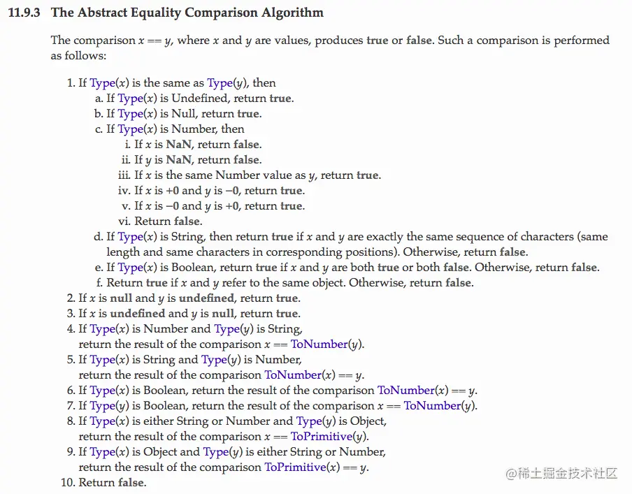

## 手写某些函数，理解其原理

### 防抖 debounce

防抖 (debounce): 将多次高频操作优化为只在最后一次执行，通常使用的场景是：用户输入，只需再输入完成后做一次输入校验即可。

```js
function debounce(fn, wait, immediate) {
	let timer = null;

	return function () {
		let args = arguments;
		let context = this;

		if (immediate && !timer) {
			fn.apply(context, args);
		}

		if (timer) clearTimeout(timer);
		timer = setTimeout(() => {
			fn.apply(context, args);
		}, wait);
	};
}
```

### 节流 throttle

节流(throttle): 每隔一段时间后执行一次，也就是降低频率，将高频操作优化成低频操作，通常使用场景: 滚动条事件 或者 resize 事件，通常每隔 100~500 ms 执行一次即可。

```js
function throttle(fn, wait, immediate) {
	let timer = null;
	let callNow = immediate;

	return function () {
		let context = this,
			args = arguments;

		if (callNow) {
			fn.apply(context, args);
			callNow = false;
		}

		if (!timer) {
			timer = setTimeout(() => {
				fn.apply(context, args);
				timer = null;
			}, wait);
		}
	};
}
```

### 坐标转换

1. 百度坐标转高德（传入经度、纬度）

```js
function bd_decrypt(bd_lng, bd_lat) {
	var X_PI = (Math.PI * 3000.0) / 180.0;
	var x = bd_lng - 0.0065;
	var y = bd_lat - 0.006;
	var z = Math.sqrt(x * x + y * y) - 0.00002 * Math.sin(y * X_PI);
	var theta = Math.atan2(y, x) - 0.000003 * Math.cos(x * X_PI);
	var gg_lng = z * Math.cos(theta);
	var gg_lat = z * Math.sin(theta);
	return { lng: gg_lng, lat: gg_lat };
}
```

2. 高德坐标转百度（传入经度、纬度）

```js
function bd_encrypt(gg_lng, gg_lat) {
	var X_PI = (Math.PI * 3000.0) / 180.0;
	var x = gg_lng,
		y = gg_lat;
	var z = Math.sqrt(x * x + y * y) + 0.00002 * Math.sin(y * X_PI);
	var theta = Math.atan2(y, x) + 0.000003 * Math.cos(x * X_PI);
	var bd_lng = z * Math.cos(theta) + 0.0065;
	var bd_lat = z * Math.sin(theta) + 0.006;
	return {
		bd_lat: bd_lat,
		bd_lng: bd_lng,
	};
}
```

## 随机颜色

```js
function randomHexColor() {
	return (
		"#" +
		("0000" + ((Math.random() * 0x1000000) << 0).toString(16)).substr(-6)
	);
}
```

## 检测是否能跨域

```js
function corsEnabled(url) {
	var xhr = new XMLHttpRequest();
	xhr.open("HEAD", url, false);
	try {
		xhr.send();
	} catch (e) {}
	return xhr.status >= 200 && xhr.status <= 299;
}
```

## 数组乱序 Fisher–Yates

缺陷：理论上会有可能 shuffle 结果和原数组相同的情况。

```js
function shuffle(a) {
	for (let i = a.length; i; i--) {
		let j = Math.floor(Math.random() * i);
		[a[i - 1], a[j]] = [a[j], a[i - 1]];
	}
	return a;
}
```

## 面试题

### ['1', '2', '3'].map(parseInt)

输出：`[1, NaN, NaN]`

原理：

1. Array.prototype.map(callback, thisArg)，接收一个回调函数和 this，一般使用时只会用第一个参数。
2. parseInt(string, radix)，接收一个字符串并返回指定基数的十进制整数，radix 是 2-36 之间的整数，表示被解析字符串的基数。当

-   radix 小于 2 或大于 36 ，或
-   第一个非空格字符不能转换为数字。

时，会返回 NaN。

### 隐式类型转换



### 判断是否运行在移动端

```js
function isRunMobile() {
	return /Android|webOS|iPhone|iPad|BlackBerry/i.test(
		window.navigator.userAgent
	);
}
```

### URLSearchParams 快速解析 URL 中的参数，可以替代 querystring

-   url.searchParams 的构造函数就是 URLSearchParams，而 URLSearchParams 是一个具有可迭代器功能的 API，所以你可以 for...of 或者 entries 操作。

```js
function eazyFormateQueryUrl() {
	const url = new URL(window.location);
	return Object.fromEntries(url.searchParams.entries());
}
```

-   Object.fromEntries 是**还原对象**的 entries 操作。即得到原有的 object。

```js
const ret = { name: "Eric", public: "木易的OT" };
const arr = Object.entries(ret); // arr: [['name', 'Eric'], ['public', '木易的OT']]

// 为了还原成ret，有以下2种做法

// 1. for循环
const target1 = {};
arr.forEach((item) => {
	const [key, val] = item;
	target1[key] = val;
});
// target1: {name: 'Eric', public: '木易的OT'}

// 2. Object.entries
const target2 = Object.fromEntries(arr); // 注意，这里接收的是entries！！！
// target2: {name: 'Eric', public: '木易的OT'}
```

-   直接使用 URLSearchParams。
    > 这个 API 是一个原生的构造函数，可以获取地址?后面的参数信息。也可直接传入 window.location.search 或者?后面的字符串.

```js
const params = new URLSearchParams(
	"https://juejin.cn/post/7016593221815910408?test=1&name=eric"
);
params.get("name"); // eric
params.get("test"); // 1
```

```js
// URLSearchParams传入字符串
const search = new URLSearchParams("a=1&b=2&c=3");
console.log(search.toString()); // a=1&b=2&c=3
// 等价于
const search = new URLSearchParams(window.location.search);
console.log(search.toString()); // a=1&b=2&c=3
```

-   当我们使用 fetch 原生 api 请求时，new URLSearchParams 可以作为 body 参数。
-   URLSearchParams 传入**数组**，将一个对象转换成 url 参数，通常在 ajax get 请求拼接参数时，可能很有用。
-   URLSearchParams 具有可迭代器属性的特征，因此它像 Map、Set 一样具有增删查改的特性：get/append/delete/set/has/keys/values.
-   对于 URLSearchParams 可以传**字符串**，可以是**对象或是数组**，当我们获取 URLSearchParams 的 key，直接调用 xxx.keys()或者是 xxx.values()，不过这样取出的值是一个迭代器，还需要用 Array.from 中转一下。

-   对 URL 动态的添加路径

```js
function locationByNamePath(path) {
	const { origin } = window.location;
	const url = new URL(path, origin);
	window.location.href = url.href;
}
```

### 解析第三方 HTML

```js
/* eslint-disable @typescript-eslint/no-use-before-define */

import _ from "lodash";
import $ from "jquery";

function formatNewsHtml(html, opts = {}) {
	const $html = $("<div>").html(html);
	const title = $html.find("h1").text() || "";
	const options = _.defaults(opts, {
		filterLink: true,
	});

	// 移除meta头
	$html.find("meta").remove();
	// 移除title
	$html.find("title").remove();
	// 移除内敛样式
	$html.find("*[style]").removeAttr("style");
	// 移除外部样式
	$html.find("link").remove();
	$html.find("style").remove();
	// 移除外部脚本
	$html.find("script").remove();
	// 移除对齐属性
	$html.find("*[align]").removeAttr("align");
	// 移除原有标题
	$html.find("h1").remove();
	// 移除最开始的br标签
	$html.find("br").first().remove();
	// 过滤注释
	$html.contents().each((i, n) => {
		if (n.nodeType === 8) {
			$(n).remove();
		}
	});
	// 过滤空的p标签
	$html.find("p").each((index, p) => {
		const child = $(p).html().trim();
		if (child === "" || child === "<br>") {
			$(p).remove();
		}
	});

	if (options.filterLink) {
		// 移除除了s3以外的链接地址
		$html.find("a").each((index, ele) => {
			const href = $(ele).attr("href");
			if (/-s3/.test(href) === false) {
				$(ele).outerHTML = $(ele).html(); // eslint-disable-line no-param-reassign
				// eslint-disable-next-line no-script-url
				$(ele).attr("href", "javascript:void(0);");
				$(ele).onclick = function () {
					return false;
				};
				$(ele).attr("target", "");
			} else {
				$(ele).attr("target", "_blank");
			}
		});
	}

	return { title, html: $html.html() };
}

function formatHtml(html) {
	if (!_.trim(html)) {
		return "";
	}

	const $html = $("<div>").html(html);
	const title = $html.find("div:first").attr("title") || "";

	// 先处理目录
	const contents = generateContents($html);

	// 移除meta头
	$html.find("meta").remove();
	// 移除内敛样式
	$html.find("*[style]").removeAttr("style");
	// 移除外部样式
	$html.find("link").remove();
	$html.find("style").remove();
	// 移除外部脚本
	$html.find("script").remove();
	// 移除对齐属性
	$html.find("*[align]").removeAttr("align");
	// 格式化表格
	formatTable($html);

	return { title, html: $html.html(), contents };
}

function formatTable($html) {
	// 外层嵌套，为了后续优化
	const $table = $html
		.find("table")
		.wrap('<div class="wrapper"><div class="table-wrapper"></div></div>')
		.removeAttr("type");

	// 处理table
	$html.find(".wrapper").each((index, element) => {
		const $element = $(element);
		if ($element.text().trim().length > 0) {
			// 如果只有一行内容，转换成文本
			// 如果超过一行，添加复制表格的icon
			if ($element.find("table tr").length === 1) {
				$element.html($element.text());
			} else {
				$element.prepend(
					'<span class="copy-table" title="复制表格"><i class="dyfont dy-copy" /></span>'
				);
			}
		} else {
			$element.remove();
		}
	});

	// 处理表格标题，对于非标准无th元素的表格，按第一列最高rowspan数来决定表格标题高度
	$table.each((index, element) => {
		const $element = $(element);
		if ($element.find("th").length === 0) {
			let count = 1;
			$element.find("tr:eq(0) td[rowspan]").each((i, td) => {
				const rowspan = $(td).attr("rowspan") || 1;
				if (rowspan > count) {
					count = rowspan;
				}
			});

			$element.find(`tr:lt(${count})`).addClass("table-title");
		}
	});

	// 处理表格内容及宽度
	$table.find("td").each((index, td) => {
		const $td = $(td);
		const text = $td.text().trim();
		const textLen = text.length;

		if ($td.children().length > 0) {
			$td.find("span").each((i, span) => {
				$(span).html($(span).html().trim());
			});
		} else {
			$td.html(text);
		}

		const regex =
			/^[+\-$￥¥€£]{0,1}\s{0,1}((\d+,{0,1})*|\d+)(\.\d+){0,1}%{0,1}(%%){0,1}$/;
		if (text.match(regex)) {
			$td.css({
				"text-align": "center",
				"min-width": `${textLen / 2 + 1}em`, // eslint-disable-line no-mixed-operators
			});
		} else {
			const minWidth = textLen < 40 ? textLen * 3 + 60 : 180; // eslint-disable-line no-mixed-operators
			$td.css({
				"min-width": `${minWidth}px`,
			});
		}
	});
}

function generateContents($html) {
	const $sections = $html.find("div[id^=SectionCode]");
	let contents = [];
	let $item;
	let title;
	let id;
	let pid;
	let depth;

	_.each($sections, (item) => {
		$item = $(item);
		title = $item.attr("title");
		id = $item.attr("id");

		// 如果标题不存在或id不合法，则不属于目录
		if (title && id) {
			// SectionCode_2-2-1: id: 2-2-1, pid: 2-2
			id = id.split("_")[1];
			depth = id.split("-").length;
			if (depth > 1) {
				pid = id.substr(0, id.lastIndexOf("-"));
			} else {
				pid = 0;
			}

			// 生成目录的时候顺便添加对应的标题
			$("<div>")
				.attr({
					class: `sub-title sub-title-${
						depth > 2 ? "3" : depth > 1 ? "2" : "1" // eslint-disable-line no-nested-ternary
					}`,
				})
				.text(title)
				.prependTo($item);

			contents.push({
				id,
				pid,
				title,
			});
		}
	});
	contents = generateContentsTree(contents);
	return contents;
}

// 本函数处理按序加载的层级结构，如果无序，则需另写函数，这边为了性能就不考虑
function generateContentsTree(contents) {
	const root = { id: 0, children: [] };
	const contentsMap = {};
	let node;
	let parent;

	_.each(contents, (c) => {
		node = { id: c.id, pid: c.pid, title: c.title, children: [] };
		contentsMap[c.id] = node;
		if (c.pid === 0) {
			root.children.push(node);
		} else {
			parent = contentsMap[c.pid];
			if (parent) {
				parent.children.push(node);
			}
		}
	});

	return [root];
}

export { formatHtml, formatNewsHtml };
```

### XMLHttpRequest

```js
const fetchHR = (url: string) => {
	const xhr = new XMLHttpRequest();
	xhr.open("GET", url);
	xhr.onreadystatechange = function (e) {
		if (xhr.readyState === 4) {
			// const { html, content } = formatHtml(xhr.responseText);
			const { html } = formatNewsHtml(xhr.responseText);
			// console.log('html', html);
			setFormatedHtml(html);
		}
	};
	xhr.send();
};
```
