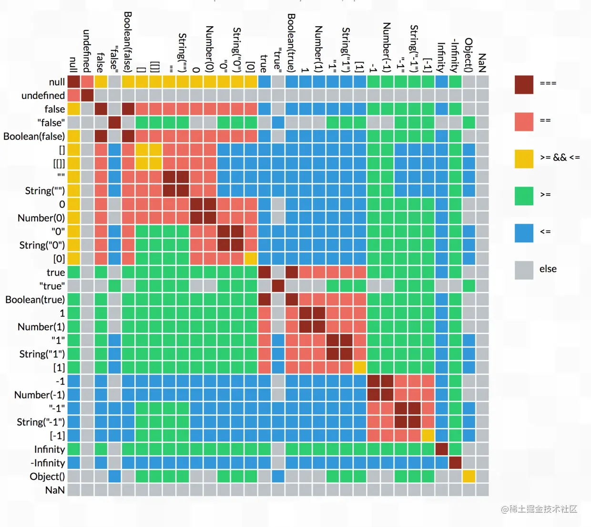

## 原型、继承、原型链

-   [参考](https://juejin.cn/post/6844903837623386126)

-   

ECMAScript 中\-所有\-函数的参数都是按值传递的。也就是说，把函数外部的值复制给函数内部的参数，就和把值从一个变量复制到另一个变量一样。

共享传递是指，在传递对象的时候，传递对象的引用的副本。注意：按引用传递是传递对象的引用，而按共享传递是传递对象的引用的副本！

**参数如果是基本类型是按值传递，如果是引用类型按共享传递**。但是因为拷贝副本也是一种值的拷贝，所以在高程中也直接认为是按值传递了。

### ES5/ES6 的继承除了写法以外还有什么区别

1. ES6 子类可以直接通过 `__proto__` 寻址到父类:`Sub.__proto__ === Super`。而通过 ES5 的方式:`Sub.__proto__ === Function.prototype`。
2. ES5 和 ES6 子类 this 生成顺序不同。ES5 的继承先生成了子类实例，再调用父类的构造函数修饰子类实例，ES6 的继承先生成父类实例，再调用子类的构造函数修饰父类实例。这个差别使得 ES6 可以继承 js 内置对象。
3. class 声明不会提升，如同 let、const，会造成暂时性死区。
4. class 声明内部会启用严格模式。
5. class 的所有方法（包括静态方法和实例方法）都是不可枚举的。
6. class 的所有方法（包括静态方法和实例方法）都没有原型对象 prototype，所以也没有`[[construct]]`，不能使用 new 来调用。
7. 必须使用 new 调用 class。
8. class 内部无法重写类名。

## 类型转换

-   依赖 valueOf,toString,ToPrimitive
-   真值表如下:
-   

## 静态作用域与动态作用域

JavaScript 采用词法作用域(lexical scoping)，也就是静态作用域。函数的作用域在函数定义的时候就决定了。而与词法作用域相对的是动态作用域，函数的作用域是在函数调用的时候才决定的。

## 判断上传的文件类型

1. 通过 input 元素的 accept 属性来限制文件的类型

```html
<input id="file" type="file" accept="image/*" />
```

2. 通过截取文件名后缀的方式来判断

```js
const ext = file.name.substring(file.name.lastIndexOf(".") + 1);
```

3. 利用 file-type

4. 利用 vscode 插件 hexdump for VSCode 以十六进制的形式查看二进制文件--同一种类型的文件，他们的头信息是完全相同的
    > 1. 在获取文件对象后，我们可以通过 FileReader API 来读取文件的内容;
    > 2. 然后将结果转为 Unicode 编码，再转为十六进制;
    > 3. **没有必要将整个文件转为十六进制，我们只需要截取文件的前几个字节，然后将截取后的文件转为十六进制，再进行比对就可以**;

```html
<input id="file" type="file" />
<script>
	file.addEventListener("change", async (e) => {
		const file = e.target.files[0];
		const flag = await isImage(file);
		if (flag) {
			alert("上传格式通过！");
		} else {
			alert("请上传正确的格式！");
		}
	});
	// 判断是否为图片
	async function isImage(file) {
		return (
			(await isGif(file)) || (await isPng(file)) || (await isJpg(file))
		);
	}
	// 判断是否为 jpg 格式
	async function isJpg(file) {
		const res = await blobToString(file.slice(0, 3));
		return res === "FF D8 FF";
	}
	// 判断是否为 png 格式
	async function isPng(file) {
		const res = await blobToString(file.slice(0, 4));
		return res === "89 50 4E 47";
	}
	// 判断是否为 gif 格式
	async function isGif(file) {
		const res = await blobToString(file.slice(0, 4));
		return res === "47 49 46 38";
	}
	// 将文件转为十六进制字符串
	async function blobToString(blob) {
		return new Promise((resolve) => {
			const reader = new FileReader();
			reader.onload = function () {
				const res = reader.result
					.split("") // 将读取结果分割为数组
					.map((v) => v.charCodeAt()) // 转为 Unicode 编码
					.map((v) => v.toString(16).toUpperCase()) // 转为十六进制，再转大写
					.map((v) => v.padStart(2, "0")) // 个位数补0
					.join(" "); // 转为字符串
				resolve(res);
			};
			reader.readAsBinaryString(blob); // 将文件读取为二进制字符串
		});
	}
</script>
```

## .env 文件原理解析

-   一句话总结 dotenv 库的原理。用 fs.readFileSync 读取 .env 文件，并解析文件为键值对形式的对象，将最终结果对象遍历赋值到 process.env 上。

> Dotenv 是一个零依赖模块，可将 .env 文件中的环境变量加载到 process.env 中
> 如果需要使用变量，则配合如下扩展包使用 —— dotenv-expand

### 4 个功能

1. 读取 .env 文件
2. 解析 .env 文件拆成键值对的对象形式
3. 赋值到 process.env 上
4. 最后返回解析后得到的对象

## open 的原理

-   用法：--open 或者 --no-open
-   地址[open](https://github.com/sindresorhus/open)

-   一句话概括 open 原理则是：针对不同的系统，使用 Node.js 的子进程 child_process 模块的 spawn 方法，调用系统的命令打开浏览器.
-   对应的系统命令简单形式则是：

```bash
# mac
open https://ericyangxd.top/
# win
start https://ericyangxd.top/
# linux
xdg-open https://ericyangxd.top/
```

## 前端生成水印 watermark

### 使用 Canvas

-   原理：使用 Canvas 绘制好图片，利用 canvas.toDataURL()转换为 base64 格式，然后给顶层的#root 设置 background-image 即可，注意调整样式。
    示例代码：

```js
var canvas = document.getElementById("canvas");
const angle = -40;
const txt = `Good Luck Infinity Co. ericyangxd.top ${new Date().toLocaleDateString()} ${new Date().toLocaleTimeString()}`;
const canvasWidth = 500;
const canvasHeight = 500;
if (canvas.getContext) {
	// drawing code here
	canvas.width = canvasWidth;
	canvas.height = canvasHeight;
	const ctx = canvas.getContext("2d");
	// 通过把像素设置为透明以达到擦除一个矩形区域的目的。
	// 请确保在调用 clearRect()之后绘制新内容前调用beginPath() 。
	// 清除整个画布
	ctx.clearRect(0, 0, canvasWidth, canvasHeight);
	// 文字填充颜色
	ctx.fillStyle = "#000";
	// 文字透明度
	ctx.globalAlpha = 0.8;
	// 同CSS font，至少包含font-size和font-family
	ctx.font = "bold 20px 微软雅黑";
	// 旋转弧度
	ctx.rotate((Math.PI / 180) * angle);
	// -280： 文字向左偏移； 380：文字向下偏移； strokeText：中空字体； fillText：实线字体
	ctx.fillText(txt, -280, 380);
}
```

### 透明图片覆盖

-   太 low 了，不用

## 一个 function

```js
function f() {
	conssole.log(arguments);
}

var a = `world`;
f`Hello ${a}!`;
// 会打印如下：
// [["Hello ","!"],"world"]
```

## JS 类型

### 对应类型

-   JS 7(8) 种基本类型对应的是：undefined, null, object, boolean, string, number, symbol(, bigint)。
-   那么 7 种语言类型应该对应的什么？作者回复:
    -   List 和 Record
    -   Set
    -   Completion Record
    -   Reference
    -   Property Descriptor
    -   Lexical Environment 和 Environment Record
    -   Data Block

### 类型检测

| 不同类型/优缺点 | typeof                      | instanceof                        | constructor                                  | Object.prototype.toString.call        |
| --------------- | --------------------------- | --------------------------------- | -------------------------------------------- | ------------------------------------- |
| 优点            | 简单易用                    | 检测引用类型                      | 基本能检测所有的类型（除 null 和 undefined） | 可以检测出所有类型                    |
| 缺点            | 只能检测基本类型（除 null） | 只能检测引用类型，且不能跨 iframe | constructor 易被修改，也不能跨 iframe        | IE6 下，undefined 和 null 均为 Object |

### 模块化发展历程

模块化主要是用来抽离公共代码，隔离作用域，避免变量冲突等。

1. IIFE： 使用自执行函数来编写模块化，特点：在一个单独的函数作用域中执行代码，避免变量冲突。
2. AMD： 使用 requireJS 来编写模块化，特点：依赖必须提前声明好。
3. CMD： 使用 seaJS 来编写模块化，特点：支持动态引入依赖文件。
4. CommonJS： nodejs 中自带的模块化。
5. UMD：兼容 AMD，CommonJS 模块化语法。
6. webpack(require.ensure)：webpack 2.x 版本中的代码分割。
7. ES Modules： ES6 引入的模块化，支持 import 来引入另一个 js 。

### XHR 请求文件

```js
// 可以跨域请求 html
var xhr = new XMLHttpRequest();
xhr.open("GET", "http://xyz.example.com/secret/file.txt");
xhr.onreadystatechange = function (e) {
	if (xhr.readyState === 4) {
		console.log("got result: ", xhr.responseText);
	}
};
xhr.send();
```

-   然后可以对这个文件进行解析啥的`formatHtml(xhr.responseText)`，适用于抓到别人的网页之后，解析一下 body 放到自己的页面里。

### 移除 a 标签的默认跳转行为

```js
// 1
$(ele).attr("href", "javascript:void(0);");
// 2
$(ele).onclick = function () {
	return false;
};
// 3
$(ele).attr("target", "");
```

### 通过 Canvas 做 web 身份识别

-   原理：通过 Canvas 生成指纹，做识别。

```js
// PHP 中，bin2hex() 函数把 ASCII 字符的字符串转换为十六进制值。字符串可通过使用 pack() 函数再转换回去
// 下面是PHP 的 bin2hex 的 JavaScript 实现
function bin2hex(s) {
	let n,
		o = "";
	s += "";
	for (let i = 0, l = s.length; i < l; i++) {
		n = s.charCodeAt(i).toString(16);
		o += n.length < 2 ? "0" + n : n;
	}

	return o;
}

// 获取指纹UUID
function getUUID(domain) {
	// 创建 <canvas> 元素
	let canvas = document.createElement("canvas");
	// getContext() 方法可返回一个对象，该对象提供了用于在画布上绘图的方法和属性
	let ctx = canvas.getContext("2d");
	// 设置在绘制文本时使用的当前文本基线
	ctx.textBaseline = "top";
	// 设置文本内容的当前字体属性
	ctx.font = "14px 'Arial'";
	// 设置用于填充绘画的颜色、渐变或模式
	ctx.fillStyle = "#f60";
	// 绘制"被填充"的矩形
	ctx.fillRect(125, 1, 62, 20);
	ctx.fillStyle = "#069";
	// 在画布上绘制"被填充的"文本
	ctx.fillText(domain, 2, 15);
	ctx.fillStyle = "rgba(102, 204, 0, 0.7)";
	ctx.fillText(domain, 4, 17);

	// toDataURL返回一个包含图片展示的 data URI
	let b64 = canvas.toDataURL().replace("data:image/png;base64,", "");
	// atob() 方法用于解码使用 base-64 编码的字符串；base-64 编码使用方法是 btoa()，这俩都是window全局方法
	let crc = bin2hex(atob(b64).slice(-16, -12));
	return crc;
}

// 调用时，你可以传入任何你想传的字符串，并不局限于传递domain，这里只是为了便于区分站点
console.log(getUUID("https://www.baidu.com/"));
```

## 回车与换行

电传打字机：

1. 在每行后面加两个表示结束的字符：一个叫做"回车"，告诉打字机把打印头定位在左边界；另一个叫做"换行"，告诉打字机把纸向下移一行。

计算机发明后：

1. Unix 系统里，每行结尾只有`<换行>`，即`\n`；
2. Windows 系统里面，每行结尾是`<回车><换行>`，即`\r\n`；
3. Mac 系统里，每行结尾是`<回车>`。

一个直接后果是，Unix/Mac 系统下的文件在 Windows 里打开的话，所有文字会变成一行；而 Windows 里的文件在 Unix/Mac 下打开的话，在每行的结尾可能会多出一个^M 符号。

`\n`是匹配一个换行符，`\r`是匹配一个回车符。`\0`表示匹配 NULL（U+0000）字符，空字符（Null character）又称结束符，缩写 NUL，是一个数值为 0 的控制字符。

## React 源码中的位运算

### 按位与（&）、或（|）、非（～）

在 JS 中，位运算的操作数会先转换为 Int32（32 位有符号整型），执行完位运算会把 Int32 转换回对应浮点数。Int32 的最高位是符号位，不保存具体的数.

1. 找出当前最高优先级的更新在哪一位，低位优先级高：

```js
// 由于Int32采用「补码」表示，所以-lanes可以看作如下两步操作：
// 1. lanes取反（~lanes）
// 2. 加1
function getHighestPriorityLane(lanes) {
	return lanes & -lanes;
}
```

## JavaScript 核心原理解析

### 01|delete 0

1. delete 这个操作的正式语法设计并不是“删除某个东西”，而是“删除一个表达式的结果”：`delete UnaryExpression`。
2. 在 JavaScript 中，有两个东西可以被执行并存在执行结果（Result），包括语句和表达式。
3. 表达式的值，在 ECMAScript 的规范中，称为“引用”。
4. 在进一步的删除操作之前，JavaScript 需要检测这个 Result 的类型：
    1. 如果它是值，则按照传统的 JavaScript 的约定返回 true；
    2. 如果它是一个引用，那么对该引用进行分析，以决定如何操作。
5. ECMAScript 约定：任何表达式计算的结果（Result）要么是一个值，要么是一个引用。
6. “delete x”归根到底，是在删除一个表达式的、引用类型的结果（Result），而不是在删除 x 表达式，或者这个删除表达式的值（Value）。
7. delete 运算符尝试删除值数据时，会返回 true，用于表示没有错误（Error）。
8. delete 0 的本质是删除一个表达式的值（Result）。
9. delete x 与上述的区别只在于 Result 是一个引用（Reference）。
10. delete 其实只能删除一种引用，即对象的成员（Property）。
11. delete x 中，如果 x 根本不存在，会返回 true。
12. delete object.x 中，如果 x 是只读的，会 delete object.x 不能删除掉 x 属性，返回 false；如果在严格模式下，会报错：TypeError: Cannot delete property 'x'。
13. 访问不存在的变量 x 报 ReferenceError 错误，其实是对 x 表达式的的 Result 引用做 getValue 的时候报的错误，然后为啥 typeof x 和 delete x 不报错，因为这两个操作没有求值。

### 02 | var x = y = 100

在这行代码中，等号的右边是一个表达式 y = 100，它发生了一次“向不存在的变量赋值”，所以它「隐式地声明了一个全局变量」y，并赋值为 100。

严格意义上讲，JavaScript 只有变量和常量两种标识符，六条声明语句:

-   `let x …` : 声明变量 x。不可在赋值之前读。
-   `const x …` : 声明常量 x。不可写。
-   `var x …` : 声明变量 x。在赋值之前可读取到 undefined 值。
-   `function x …` : 声明变量 x。该变量指向一个函数。
-   `class x …` : 声明变量 x。该变量指向一个类（该类的作用域内部是处理严格模式的）。
-   `import …` : 导入标识符并作为常量（可以有多种声明标识符的模式和方法）。

> NOTE：6 种声明语句中的函数是按 varDecls 的规则声明的；类的内部是处于严格模式中，它的名字是按 let 来处理的，而 import 导入的名字则是按 const 的规则来处理的。所以，所有的声明本质上只有三种处理模式：var 变量声明、let 变量声明和 const 常量声明。

除了这六个语句之外，还有两个语句有潜在的声明标识符的能力，不过它们并不是严格意义上的声明语句（声明只是它们的语法效果）。这两个语句是指：

-   `for (var|let|const x …) …` : for 语句有多种语法来声明一个或多个标识符，用作循环变量。
-   `try … catch (x) …` : catch 子句可以声明一个或多个标识符，用作异常对象变量。

一个简单论断，所有的“声明”：

-   都意味着 JavaScript 将可以通过“静态”语法分析发现那些声明的标识符；
-   标识符对应的变量 / 常量“一定”会在用户代码执行前就已经被创建在作用域中。

回到 ECMAScript 6 之前：JavaScript 是允许访问还没有绑定值的 var 所声明的标识符的。这种标识符后来统一约定称为“变量声明（varDelcs）”，而“let/const”则称为“词法声明（lexicalDecls）”。JavaScript 环境在创建一个“变量名（varName in varDecls）”后，会为它初始化绑定一个 undefined 值，而”词法名字（lexicalNames）”在创建之后就没有这项待遇，所以它们在缺省情况下就是“还没有绑定值”的标识符。

1. var 等声明语句总是在变量作用域（变量表）或词法作用域中静态地声明一个或多个标识符。
2. 全局变量的管理方式决定了“向一个不存在的变量赋值”所导致的变量泄漏是不可避免的。
3. 动态添加的“var 声明”是可以删除的，这是唯一能操作 varNames 列表的方式（不过它并不存在多少实用意义）。
4. 变量声明在引擎的处理上被分成两个部分：一部分是静态的、基于标识符的词法分析和管理，它总是在相应上下文的环境构建时作为名字创建的；另一部分是表达式执行过程，是对上述名字的赋值，这个过程也称为绑定。
5. 这一讲标题里的这行代码中，x 和 y 是两个不同的东西，前者是声明的名字，后者是一个赋值过程可能创建的变量名。

### 03 | a.x = a = {n:2}

```js
var b = (a = { n: 1 });
a.x = a = { n: 2 };
console.log(a.n); // 2
console.log(a.x); // undefined
console.log(b.n); // 1
console.log(b.x); // { n: 2 }
```

忽略 b，上面发生了两次赋值，第一次赋值发生于“a = {n: 2}”，它覆盖了“原始的变量 a”；第二次赋值发生于被“a.x”引用暂存的“原始的变量 a”。所以，第二次赋值操作“a.x = …”实际是无意义的。因为它所操作的对象，也就是“原始的变量 a”被废弃了。

### 04 | export default function() {}

`export default function() {}`，在严格意义上来说它并不是导出了一个匿名函数表达式，而是导出了一个匿名函数定义（Anonymous Function Definition）。这个语法本身没有任何的问题。但是他看似导出一个匿名函数表达式。其实他真正导出的是一个具有名字的函数，名字是`default`。

ECMAScript 6 模块是静态装配的，而传统的 Node.js 模块却是动态加载的。

```js
// 导出“（声明的）名字”
export <let/const/var> x ...;
export function x() ...
export class x ...
export {x, y, z, ...};


// 导出“（重命名的）名字”
export { x as y, ...};
export { x as default, ... };


// 导出“（其它模块的）名字”
export ... from ...;


// 导出“值”
export default <expression
```

一个 export 也必须理解为这样两个步骤：导出一个名字；为上述名字绑定一个值。

### 05 | for (let x of [1,2,3]) ...

绝大多数 JavaScript 语句都并没有自己的块级作用域。从语言设计的原则上来看，越少作用域的执行环境调度效率也就越高，执行时的性能也就越好。基于这个原则，switch 语句被设计为有且仅有一个作用域，无论它有多少个 case 语句，其实都是运行在一个块级作用域环境中的。

并不是所有的循环语句都有自己的块级作用域，例如 while 和 do..while 语句就没有。而且，也不是所有 for 语句都有块级作用域。在 JavaScript 中，有且仅有：
`for (let/const ...) ...`这个语法有自己的块级作用域。当然，这也包括相同设计的`for await`和`for .. of/in ..`。PS:不包括 var 声明，因为 var 会变量提升。

-   所有“var 声明”和函数声明的标识符都登记为 varNames，使用“变量作用域”管理；
-   其它情况下的标识符 / 变量声明，都作为 lexicalNames 登记，使用“词法作用域”管理。

循环语句（对于支持“let/const”的 for 语句来说）“通常情况下”只支持一个块级作用域。

for 语句中使用“let/const”这种块级作用域声明所需要付出的代价：在语法上只需要两个“块级作用域”，而实际运行时却需要为其中的第二个块级作用域（for 循环体）创建无数个副本。这种 for 循环并不比使用函数递归节省开销。因为每一次函数调用其实都会创建一个新的闭包——也就是函数的作用域的一个副本。

-   在 es6 中，其实 for 只要写大括号就代表着块级作用域。所以只要写大括号，不管用 let 还是 var，一定是会创建相应循环数量的块级作用域的。
-   如果不用大括号，在 for 中使用了 let，也会创建相应循环数量的块级作用域。
-   也就是说，可以提高性能的唯一情况只有（符合业务逻辑的情况下），循环体是单行语句就不使用大括号且 for 中使用 var。
